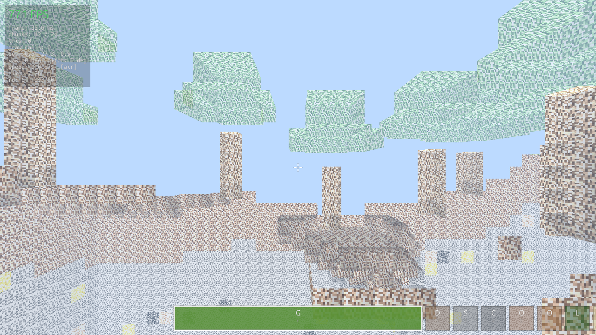
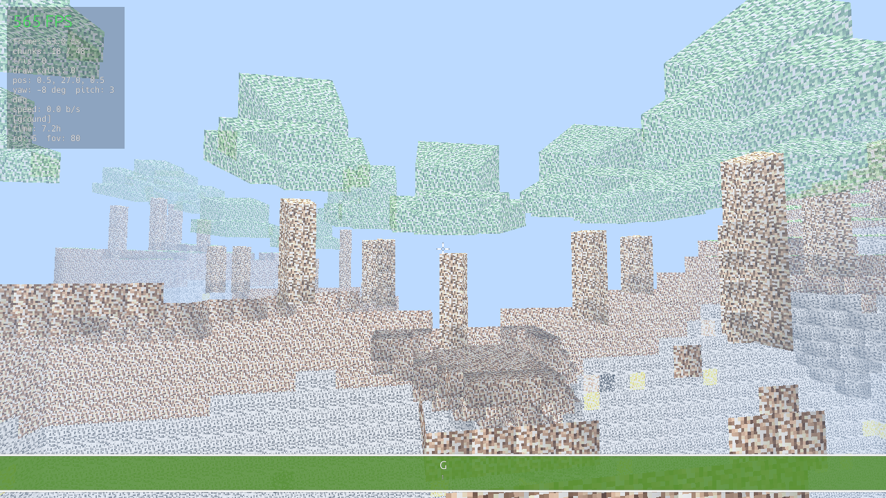

# VoxelCraft

A high-performance, **single-codebase Minecraft-1.16.5-style voxel engine** written in **Rust** on top of `wgpu` — the same graphics abstraction that powers Bevy and Veloren. One codebase, two targets:

- **Native** (Windows / Linux / macOS) → Vulkan · DirectX 12 · Metal
- **Browser** (WASM + WebGPU, with automatic WebGL2 fallback) → served as static files, **prebuilt and included** so it can be run instantly

## Libraries — download them separately (no all-in-one bundle)

The engine is split into **14 independent libraries** (`vc-nbt`, `vc-blocks`, `vc-world`, `vc-mesh`, `vc-render`, …), each one a normal Rust crate with its own README, usage example and test suite. On the [Releases](https://github.com/CodeAbhi826/VoxelCraft-Rust/releases) page **every library ships as its own archive** (`vc-nbt-0.3.0-source.tar.gz`, `vc-blocks-0.3.0-source.tar.gz`, …) next to the per-architecture game binaries — there is deliberately **no AIO zip**. Grab exactly what you need and drop it into your project as a path dependency.

→ Full index with per-library instructions: **[`voxelcraft/LIBRARIES.md`](voxelcraft/LIBRARIES.md)**





## Quick start — run it in the browser (dev preview)

No toolchain needed. The repo ships the prebuilt WASM bundle — this is the fastest way to **run and verify** the engine (it is a development preview of the native build, not an end-user product):

```sh
cd voxelcraft
python3 -m http.server 8080
# open http://localhost:8080/play.html  (Chromium 113+ or any WebGPU browser)
```

Or just open `voxelcraft/play.html` through any static file server.

## Quick start — native build

```sh
# 1. Install Rust
curl https://sh.rustup.rs -sSf | sh -s -- -y --default-toolchain stable   # (see BUILD.md)
source "$HOME/.cargo/env"

# 2. Run
cd voxelcraft
cargo run --release
```

- Linux audio wants ALSA dev headers: `sudo apt install -y libasound2-dev` (otherwise `cargo run --release --no-default-features` builds without sound)
- macOS / Windows work out of the box (CoreAudio / WASAPI)
- wgpu auto-picks the best GPU backend per platform (Vulkan / DX12 / Metal)

## Why it is fast

The previous prototype of this game was JavaScript/Chromium and suffered heavy frame drops. This engine fixes all of it:

- **Greedy meshing** — up to hundreds of merged quads per chunk; an entire flat ocean is one quad
- **Per-vertex ambient occlusion + smooth skylight** flood-fill (BFS) — the exact "smooth lighting" look, while still allowing greedy merging (equal AO/sky corner tuples)
- **Multi-threaded** chunk generation and meshing on native (Rayon), time-budgeted inline streaming on WASM so the browser stays at 60 fps
- **Frustum culling** + per-chunk `draw_indexed` calls, one texture atlas = one bind group
- **Occlusion-flood cache** — the chunk-graph visibility flood recomputes only when the camera crosses a section or a mesh uploads, not every frame
- **Tile-safe atlas sampling** — half-texel UV inset + analytic gradients (`textureSampleGrad`) so bilinear/mipmap/anisotropic filtering can never bleed neighboring atlas tiles (no texture seams, correct LOD at every block boundary)
- **Copy-on-write chunk edits** — in-flight mesh jobs with old snapshots stay consistent while you build

## Zero asset files

All 16×16 textures and every sound are **synthesized procedurally at startup** (in code). They are in the style of Minecraft 1.16.5 but were made from scratch — no Mojang assets were copied, bit-for-bit, anywhere.

## Controls

| Key                | Action                                      |
|--------------------|---------------------------------------------|
| WASD               | Move                                        |
| Mouse              | Look around (cursor is locked)              |
| Space              | Jump / swim up / fly up                     |
| **Double Space**   | Toggle flying (**Creative mode only** — see game modes) |
| Shift              | Fly down / sneak in water                   |
| Ctrl               | Sprint (FOV widens)                         |
| Left click (hold)  | Break blocks                                |
| Right click (hold) | Place blocks                                |
| Middle click       | Pick block into hotbar                      |
| 1–9 / wheel        | Select hotbar slot                          |
| F3                 | Debug overlay (fps, XYZ, biome, tris...)    |
| H                  | Help screen                                 |
| `[` `]`            | Render distance – / +                       |
| `-` `=`            | Volume – / +                                |
| V                  | Toggle V-Sync                               |
| Esc                | Pause / release mouse                       |

## World

- Procedural terrain: simplex 2D/3D noise, biomes (plains / forest / desert / snow / ocean), caves, trees
- Day/night cycle (10 min), dynamic sun/moon/stars, sunset band, fog
- Water with wave animation, glass, 18 block types
- 16×256×16 chunks streamed around the player

## Roadmap progress

The engine is being completed phase by phase (one commit per phase, values verified against minecraft.wiki; unverifiable values are explicitly marked placeholders):

| Phase | Scope | Status |
|---|---|---|
| 0 | Apache-2.0 license + README | ✅ done |
| 1 | Game modes (Creative/Survival/Hardcore), world creation, death & respawn | ✅ done |
| 2 | Mobs + combat (attack cooldown, armor, crits, light-gated spawning) | ✅ done |
| 3 | Full redstone (repeaters, comparators, pistons, containers) | ✅ done |
| 4 | Enchanting (38 entries) + brewing chain | ✅ done |
| 5 | Villager trading depth (15 professions, 5 tiers) + dungeons with spawners | ✅ done |
| 6 | Rendering optimization (mipmaps, aniso, MSAA, occlusion culling, simulation distance) | ✅ done |
| 7 | GPU compute meshing (WGSL greedy mesher, bit-identical to CPU) | ✅ done |
| 8 | Iris integration interface (shader-pack structure validation + translator seam) | ✅ done |
| 9 | Datapacks (Mojang official format: recipes, loot tables, tags; folder + zip packs) | ✅ done |
| 10 | Content breadth (6 new biomes, mineshafts, ravines, desert pyramids, jungle temples, strongholds) | ✅ done |

**Version-evolution bracket 1/16 (MC 1.0–1.2, "Core World Content"):** per the 1.0 → 1.16.5 version-evolution plan, this repo now implements the first historical bracket — **The End dimension** (entry platform at (100, 0), central end-stone island, 10 obsidian pillars on the 42-radius circle, 10 end crystals — 2 caged, stronghold 12-frame end-portal ring with eye-of-ender activation, dimension travel both ways), the **Ender Dragon fight** (200 HP, player-only damage, crystal healing 1 HP/10 ticks in a 32-block cuboid with 10-HP destruction backlash, power-6 crystal explosions, death timeline — XP at 154 ticks, exit portal + egg at 200, 12,000 first-kill XP), the **Nether Fortress** (432×432 Java regions, nether-brick bridges, up to 2 blaze-spawner platforms, nether-wart gardens), the **Mushroom Fields** biome (mycelium, huge mushrooms with exactly 45 cap blocks, mooshrooms, no hostile spawns), **7 new mobs** (Snow Golem, Magma Cube with size-scaled stats, Blaze, Ocelot, Iron Golem, Zombie Villager with the full cure lifecycle, Mooshroom), the **XP orb system** (vanilla 1/3/7/…/2477 ladder, 7.25-block attraction, 10 orbs/s gate, no merging — a 1.17 mechanic), **spawn eggs**, and the bracket's blocks (mycelium spread/revert, redstone lamp with the 4-game-tick off delay, chiseled stone bricks + sandstone variants, nether-wart crop, end stone) with clean-room art for all of it. Every constant was **live-verified against minecraft.wiki at implementation time** (204 `VERIFIED` citations in code; the round's research record, including disclosed wiki self-contradictions, is `docs/research/phase1-1.0-1.2-research.md`). Verified: **339/339 tests** green, wasm32 clean. Progress log: `docs/WORKLOG.md`.

**Version-evolution bracket 2/16 (MC 1.3–1.4, "Adventure Features"):** the second historical bracket lands the **Wither boss fight** (summon = 4 soul sand in a T + 3 wither-skeleton skulls with the last block a skull; 220-tick invulnerable charge; 300 HP Java row; 1 HP/20-tick passive regen; black skulls every 2 s at 8 HP + Wither II 10 s Normal / 40 s Hard; 40-block aggro, hovers 5 above the target; breaks a 3×4×3 box of blocks on damage; drops 1 nether star 100% + 50 XP), **three new mobs** (Wither Skeleton — 20 HP, stone sword, Wither on hit, 2.5% skull drop, fortress spawner platform; Witch — 26 HP, splash potions, ~0.97% monster-pool share; Bat — 6 HP ambient, light ≤ 3 below sea level in groups of 8), a **timed status-effect system** (Wither/Poison/Regeneration + the beacon stat effects), the **beacon** (pyramid 1–4 levels of 9/34/83/164 mixed mineral blocks, Speed/Haste at 1+, Resistance/Jump Boost at 2+, Strength at 3+, Regeneration or primary II at 4; effects every 4 s for 9+2×level s at 20/30/40/50 blocks; light 15), the **ender chest** (8 obsidian + eye of ender, shared 27 slots across every ender chest, breaks into 8 obsidian), **Adventure mode** (vanilla GameType 2 — no block break/place, interactions open), the **anvil** (3 damage stages, 12% degrade per use, gravity block), **lava as a fluid** (dimension-aware: 3-block spread per 30-tick step in the Overworld/End, 7-block spread per 10-tick step in the Nether; light 15; 4 HP per 10-tick contact damage), **emerald ore** (Mountains-family columns only, single blocks, y 4–31), and the bracket's **foods** (potato/carrot/baked potato/pumpkin pie at the verified hunger values). Structural: the block-state space widened u8 → u16 (the ≤255 window was exhausted; future brackets scale without constraint), and a latent E1 bug was fixed — `World::set_block` stored raw block ids as states, so END_PORTAL placed via the game layer read back as FURNACE. Every constant was **live-verified against minecraft.wiki at implementation time** (~120 `VERIFIED` citations; the round's research record, including the disclosed adaptation set, is `docs/research/phase2-1.3-1.4-research.md`). Verified: **372/372 tests** green, wasm32 clean. Progress log: `docs/WORKLOG.md`.

Post-Phase 10 maintenance note 3 (mechanics + visuals, verdict-gated): the two AI-generated research documents (extended mechanics + UI/visuals) were implemented under the standing `docs/research/research-verdicts.md` gate after a **live re-verification round** against minecraft.wiki (outcomes recorded in that file). Mechanics: the **exact vanilla gravity drag `v1 = (v0 − 0.08) × 0.98`** now integrates on a fixed 20 Hz substep for the player (move-then-gravity tick order; jumps re-align the substep phase and rise the vanilla 1.25 blocks), mobs (fixing a latent 20× unit bug), villagers, and item entities; mob fall damage is distance-based MC-12357 (the old impact-speed path was dead code) with substepped terminal falls that can no longer tunnel floors; swimming uses the verified speeds (sprint-swim 3.918, underwater 1.97, surface 2.20 b/s); **drowning** (air 300 → 2 HP/s at −20, 10 HUD bubbles) and the **villager gossip system** (full verified table: trade +4, attack +25, kill broadcast in a 16-block box, 20-min decay, proximity sharing, reputation = Σ value × multiplier) now drive **reputation-priced trades** (`clamp(base − floor(rep × 0.05), 1, 64)`); villagers are attackable (20 HP, no armor) so the hooks are live. Visuals: the **hopper container screen at the verdict-corrected 176×133** (one row of 5 slots — NOT the research doc's blanket 176×166, which was confirmed wrong), the **oxygen bubble row** above hunger, the **held-item name fade** above the XP bar, and **vanilla-parity F3 lines** (XYZ 3-decimals, in-chunk Block/Chunk, `Facing: south (Towards positive Z) (yaw / pitch)`, `Client Light: L (S sky, B block)` from the real light engine, `Looking at block/fluid` split). Verified: 310/310 tests green, wasm32 clean, live browser E2E (hopper screen + F3 VLM-verified — `docs/screenshots/e2e-hopper-screen.png`, `e2e-f3-lines.png`). Confirmed-wrong rows were skipped, unverified rows without an engine system were NOT stubbed (data recorded in the verdicts doc for future phases).

Phase 10 note: the world now carries **14 biomes** (Ocean, Beach, Plains, Forest, Desert, Snowy, Mountains, Nether Wastes + new: Taiga, Birch Forest, Jungle, Savanna, Swamp, Badlands — vanilla save ids and wiki grass/foliage/water tint colors, live-verified) and **5 new structures**: mineshafts (parlors + corridor networks with support beams), ravines (wiki-verified shape grammar: 85-127 long, under 15 wide, up to 62 deep), desert pyramids (21×21 stepped tiers, terracotta checkerboard floor, hidden pit to a 4-chest treasure room), jungle temples, and strongholds (ring 1 = 3 strongholds at the verified 1280-2816 distance band, library + store room + portal room with the 12-frame end-portal ring). Every structure's chests roll loot through the Phase 9 data-pack pipeline — a chunk's owning structure (dungeon > mineshaft > pyramid > jungle temple > stronghold) picks the vanilla loot table, so data-pack overrides reach every chest in the world.

Post-Phase 10 maintenance note (rendering QA): a full engine diagnosis fixed the reported **texture seams / "textures connect"** artifact and trimmed per-frame CPU cost. Root cause (two bugs compounding in the terrain and water fragment shaders): `fract(uv)` tile repetition fed straight into `textureSample`, so (1) bilinear/mipmap/aniso footprints sampled past atlas-tile boundaries — neighboring tiles' texels bled along every block edge — and (2) `fract`'s derivative discontinuity made the GPU's implicit LOD/aniso gradients explode at every integer UV, selecting the coarsest mip along every seam (grid of dark/blurry lines; aniso streaks across tiles; the water scroll dragged a moving seam). Fix: **half-texel UV inset** (`clamp(fract(uv), 0.03125, 0.96875)` — the vanilla stitched-atlas trick, NEAREST unaffected) + **`textureSampleGrad` with analytic gradients from the pre-fract UV** (derivative of fract is 1 a.e.), guarded by the `terrain_water_seam_guards_present` drift test. Also cached the §26 occlusion flood (recomputed only on camera-section change or mesh upload via a `mesh_rev` revision counter) and removed a dead per-frame `Vec` clone. Verified: 295 tests green (WGSL naga-validated), wasm32 clean, live browser E2E on WebGL2/ANGLE SwiftShader — zero console errors, mipmap+aniso path active, terrain pixel-verified (screenshots in `docs/screenshots/seamfix-e2e-*.png`).

Post-Phase 10 maintenance note 2 (fall-through-world + F3 stats): a second diagnosis pass against the reported "lag when rendering" traced the remaining symptom to the **spawn pipeline racing the mesh backlog on slow machines** — the Loading timeout could enter the game before the spawn chunk was meshed, the mesh-gated spawn snap never ran, and the player free-fell through not-yet-generated chunks into the void (observed live at y = −2312, 0 chunks drawn). Fix: the spawn snap now keys on chunk **data** instead of the GPU mesh, and player physics is **held while the player's own chunk is unloaded** (vanilla semantics: entities in unloaded chunks do not tick — also covers creative flight outrunning the generation frontier). Also fixed the F3 header's max-FPS stat (swapped fold initializers printed i32::MAX), and raised the wasm mesh-job cap 2 → 4/frame (the 6 ms inline budget stays the real frame guard). Regression tests: `physics_freezes_until_own_chunk_exists`, `fps_min_max_orders_the_folds`. Before/after: `docs/screenshots/bugfix-void-fall-before.png` → `bugfix-void-fall-after.png` (player at y = 65.89 on the surface, 38 chunks drawn). A research-verdict gate for the mechanics/UI research documents now lives at `docs/research/research-verdicts.md`, and the session-by-session history is tracked in `docs/WORKLOG.md`.

Phase 9 note: data packs follow **Mojang's official 1.16.5 format** (pack_format 6). Drop a pack — a folder or a `.zip` — into your world's `datapacks/` directory (next to `level.dat`) and the engine loads its `recipes/`, `loot_tables/` and `tags/` on world start: datapack crafting recipes appear in the crafting table, `minecraft:chests/simple_dungeon` overrides change dungeon-chest loot, and item tags drive ingredient matching. Advancements, structures and `.mcfunction` files are detected and reported honestly as not-yet-supported. Every format fact was verified against the genuine vanilla 1.16.5 server jar's own data pack.

Phase 8 note: Iris/GLSL compatibility is a **separate sister project** (`vc-iris`, per the clean-room legal boundary — the LGPL Iris source is never copied, only its published documentation). This repo ships the integration surface: drop an Iris-format pack (a folder with `shaders.properties` + `shaders/*.vsh/fsh`) into `shader-packs/` and the engine boots it through structure validation, reporting the pass chain, render targets and uniforms it found.

## Repository layout

```
voxelcraft/                     Cargo workspace (the engine + the game)
  Cargo.toml                    workspace manifest (shared versions, profile)
  LIBRARIES.md                  index of all 14 libraries + download instructions
  crates/
    vc-nbt/                     NBT codec (read/write, all 13 tag types)
    vc-blocks/                  block registry + BlockState + biome tint
    vc-rng/                     deterministic RNG
    vc-chunk/                   16×256×16 chunks, paletted sections
    vc-pack/                    resource-pack / blockstate+model JSON pipeline
    vc-inventory/               items, stacks, containers
    vc-world/                   world grid + terrain gen + light engine
    vc-mesh/                    greedy mesher (AO/skylight-aware merging)
    vc-particles/               vanilla-style break/hit particles
    vc-gameplay/                crafting, furnaces, brewing, enchanting, villagers
    vc-sim/                     20 Hz simulation: fluids, redstone, entities
    vc-anvil/                   vanilla 1.16.5 save/load (.mca + level.dat)
    vc-render/                  wgpu renderer, FSR 1.0, shader packs, UI
    vc-audio/                   synthesized sound bank + spatial audio
    voxelcraft/                 the APPLICATION (game, vc_bench, wasm entry)
  builtin-pack/                 1.16.5-format resource pack (blockstates/models/PNGs)
  shader-packs/                 demo shader packs (moonlit, warm-evening)
  wasm-out/                     prebuilt wasm-bindgen output (run instantly)
  play.html                     standalone browser loader
  BUILD.md                      full build instructions (native + wasm + all-arch)
docs/                           roadmap analysis, session logs
docs/screenshots/               in-game screenshots
public/                         same wasm build, wired into the Next.js preview wrapper
src/app/page.tsx                Next.js wrapper that serves the game at /
scripts/                        build-all.sh (all-arch one-shot builder)
```

The Next.js app in this repo root is only a thin preview wrapper (it iframes `public/voxelcraft.html`); the game itself is entirely in `voxelcraft/`.

## Rebuilding the browser bundle

```sh
cd voxelcraft                                   # workspace root
rustup target add wasm32-unknown-unknown
cargo build --release --target wasm32-unknown-unknown --lib
wasm-bindgen --version 0.2.127 --target web \
  --out-dir ./wasm-out target/wasm32-unknown-unknown/release/voxelcraft.wasm
python3 patch-wasm-glue.py wasm-out/voxelcraft.js
```

See `voxelcraft/BUILD.md` for details.

## Architecture notes

- **Chunk = 16×256×16**, `u8` block ids, stored as `Arc<Chunk>` in a `HashMap`. Player edits use copy-on-write so in-flight mesh jobs with old snapshots stay consistent.
- **Mesh job** snapshots the 3×3 neighborhood into a padded 48×256×48 buffer, computes skylight (column scan + lateral BFS), then greedy-merges per `(block, AO corner tuple, corner sky level, face light)` key.
- **Water** = separate blended pipeline (no face culling, depth-write off, top surface at y+0.875 with a vertex wave).
- **Sky** = fullscreen triangle, inverse view-proj ray, gradient + sun disc + glow + moon + twinkling stars.
- **wgpu backend selection on the web**: WebGPU when `navigator.gpu` exists, otherwise WebGL2 with downlevel limits — verified working in headless Chromium (SwiftShader).

## Disclaimer

Not affiliated with Mojang or Microsoft. "Minecraft" is a trademark of Mojang Synergies AB. This is an independent Rust engine written in the visual style of Minecraft 1.16.5; all textures and sounds are generated procedurally from scratch — none are copied from Minecraft's asset files.

## License

Licensed under the **Apache License 2.0** — see [`LICENSE`](LICENSE) for the full text.

In short: you are free to use, copy, modify, and distribute this project (including commercially), as long as you retain the license notice and state significant changes. Game *mechanics and data* (formulas, timings, recipe/loot schemas, registry names) are not copyrightable and are replicated from published documentation; all *assets* (textures, sounds, UI art) are independently authored and contain no Mojang material.
