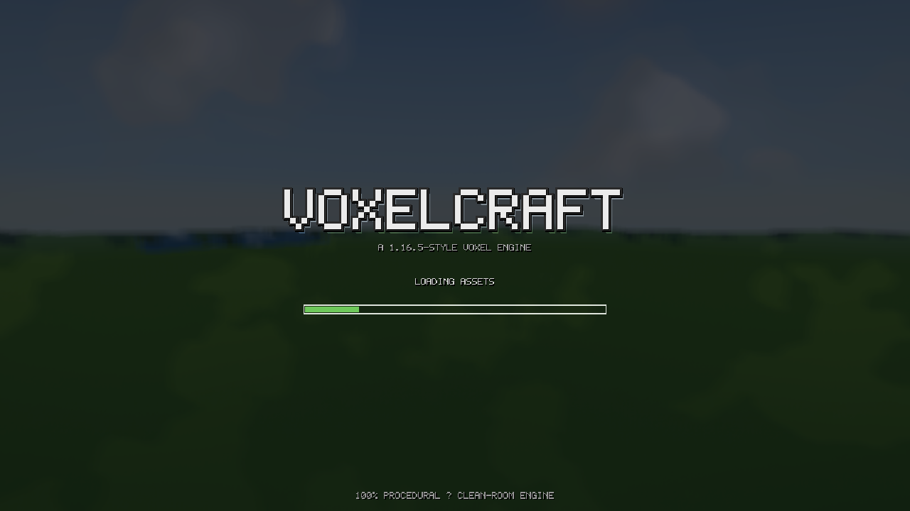
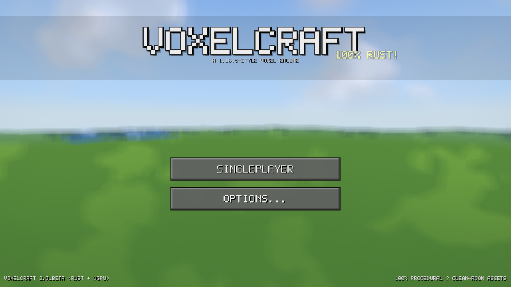
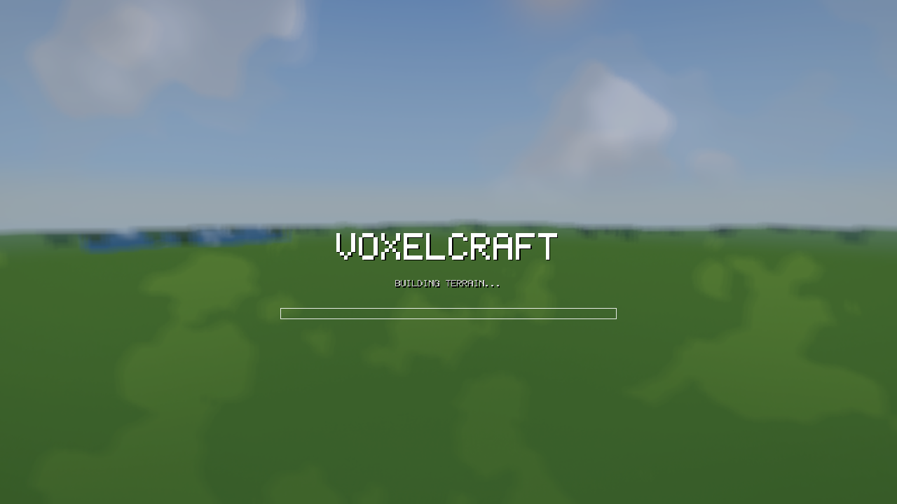
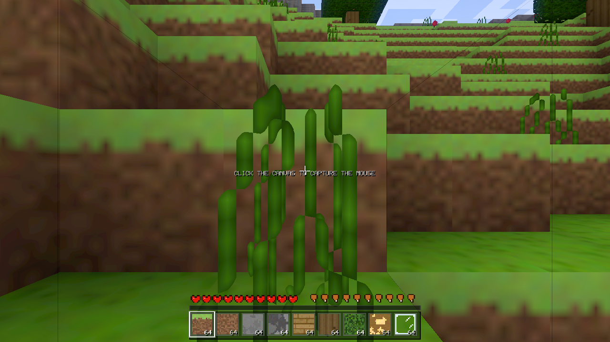
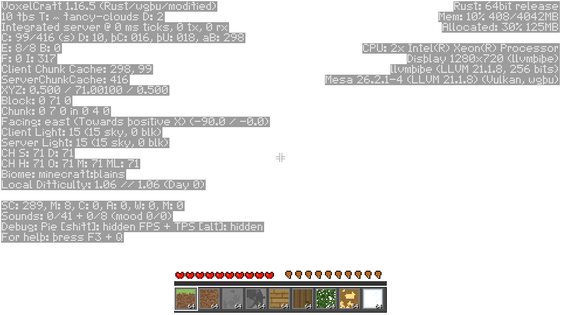

# VoxelCraft

A standalone, high-performance **Minecraft-1.16.5-style voxel game engine** written in **Rust** on top of `wgpu` — the same graphics abstraction that powers Bevy and Veloren. One codebase, two targets:

- **Native** (Windows / Linux / macOS) → Vulkan · DirectX 12 · Metal
- **Browser** (WASM + WebGPU, with automatic WebGL2 fallback) → served as static files, **prebuilt and included** so it can be run instantly

## Play it — one file, zero build (Linux)

Every push (and every release) is compiled by [**linux-game.yml**](.github/workflows/linux-game.yml) into a **single self-contained executable** — the whole engine with the builtin resource pack **embedded in the binary**, so it runs directly with no Rust toolchain, no crates to download, no companion files:

```sh
# grab "voxelcraft-*-linux-x64" from the latest run's artifacts (or a Release)
chmod +x voxelcraft-*-linux-x64
./voxelcraft-*-linux-x64          # normal launch
./voxelcraft-*-linux-x64 --debug  # raw diagnostic log (see below)
./voxelcraft-*-linux-x64 --help   # the full flag list
```

Built on `ubuntu-22.04` (glibc 2.35), so the same file runs on Debian 12+, Ubuntu 22.04+, Fedora 36+, Arch and friends. Audio is compiled in (ALSA) and degrades to silent if no sound device exists; everything else the game needs is inside the one file. Full releases (Windows / macOS / arm64 / browser bundle / per-library sources) are on the [Releases](https://github.com/CodeAbhi826/VoxelCraft-Rust/releases) page.

### `--debug` — the raw diagnostic log (bug-report channel)

Every build of the game (native single file, cargo build, browser bundle) accepts a debug switch that streams raw engine events to the terminal **and** to `logs/latest.log` in the profile folder next to the binary — this is the channel to attach when reporting a bug or glitch:

```sh
./voxelcraft-*-linux-x64 --debug          # native
# browser build: append ?debug to the page URL → lines go to the JS console
```

Each line is `[t+  12.3s][category] message` (seconds since launch). Categories: `screen` (every screen transition — the boot/menu flow), `input` (every click routed, with the screen, canvas coords and what was under it — the crosshair target in-game, the widget id in menus), `world` (world entry: name, seed, spawn, mode), `perf` (1 Hz heartbeat: fps envelope, frame/sim ms, chunk mesh/loaded/drawn counts, gen+mesh queue depths, mob count), `save` (autosave timing), `f3` (overlay toggles), `exit` (uptime, frames, fps envelope, world-edit count). The always-on boot lines (pack load, adapter, `pointer:` capture mode, loading timings) are printed either way; `--debug` adds the event stream on top. The same flag works in CI's smoke, which greps each category as a regression guard.

## Reusable engine libraries — download them separately (no all-in-one bundle)

The engine is split into **14 independent libraries** (`vc-nbt`, `vc-blocks`, `vc-world`, `vc-mesh`, `vc-render`, …), each one a normal Rust crate with its own README, usage example and test suite. On the [Releases](https://github.com/CodeAbhi826/VoxelCraft-Rust/releases) page **every library ships as its own archive** (`vc-nbt-0.3.0-source.tar.gz`, `vc-blocks-0.3.0-source.tar.gz`, …) next to the single-file game and the per-architecture binaries — there is deliberately **no AIO zip**. Grab exactly what you need and drop it into your project as a path dependency.

→ Full index with per-library instructions: **[`voxelcraft/LIBRARIES.md`](voxelcraft/LIBRARIES.md)**

The startup sequence (2026-09-07 rebuild, vanilla architecture — see maintenance note 4): boot **intro** (logo + asset progress bar, no world) → **title** on the pre-rendered, slowly panning panorama cubemap (chunks generate only on world entry) → **world-entry loading** (panorama dimmed behind the terrain progress bar) → **gameplay**.

| intro | title (panorama) |
|---|---|
|  |  |

| world loading | gameplay |
|---|---|
|  |  |



## Quick start — run it in the browser (dev preview)

No toolchain needed. The repo ships the prebuilt WASM bundle — this is the fastest way to **run and verify** the engine (it is a development preview of the native build, not an end-user product):

```sh
cd voxelcraft
python3 -m http.server 8080
# open http://localhost:8080/play.html  (Chromium 113+ or any WebGPU browser)
```

Or just open `voxelcraft/play.html` through any static file server.

## Quick start — native build

The quickest native path is the single-file build above. Building from source:

```sh
# 1. Install Rust
curl https://sh.rustup.rs -sSf | sh -s -- -y --default-toolchain stable   # (see BUILD.md)
source "$HOME/.cargo/env"

# 2. Run
cd voxelcraft
cargo run --release
```

- Linux audio wants ALSA dev headers: `sudo apt install -y libasound2-dev` (otherwise `cargo run --release --no-default-features` builds without sound)
- macOS / Windows work out of the box (CoreAudio / WASAPI)
- wgpu auto-picks the best GPU backend per platform (Vulkan / DX12 / Metal)

## Why it is fast

The previous prototype of this game was JavaScript/Chromium and suffered heavy frame drops. This engine fixes all of it:

- **Greedy meshing** — up to hundreds of merged quads per chunk; an entire flat ocean is one quad
- **Per-vertex ambient occlusion + smooth skylight** flood-fill (BFS) — the exact "smooth lighting" look, while still allowing greedy merging (equal AO/sky corner tuples)
- **Multi-threaded** chunk generation and meshing on native (Rayon), time-budgeted inline streaming on WASM so the browser stays at 60 fps
- **Frustum culling** + per-chunk `draw_indexed` calls, one texture atlas = one bind group
- **Occlusion-flood cache** — the chunk-graph visibility flood recomputes only when the camera crosses a section or a mesh uploads, not every frame
- **Tile-safe atlas sampling** — half-texel UV inset + analytic gradients (`textureSampleGrad`) so bilinear/mipmap/anisotropic filtering can never bleed neighboring atlas tiles (no texture seams, correct LOD at every block boundary)
- **Copy-on-write chunk edits** — in-flight mesh jobs with old snapshots stay consistent while you build

## Zero asset files

All 16×16 textures and every sound are **synthesized procedurally at startup** (in code). They are in the style of Minecraft 1.16.5 but were made from scratch — no Mojang assets were copied, bit-for-bit, anywhere.

## Controls

| Key                | Action                                      |
|--------------------|---------------------------------------------|
| WASD               | Move                                        |
| Mouse              | Look around (cursor is locked)              |
| Space              | Jump / swim up / fly up                     |
| **Double Space**   | Toggle flying (**Creative mode only** — see game modes) |
| Shift              | Fly down / sneak in water                   |
| Ctrl               | Sprint (FOV widens)                         |
| Left click (hold)  | Break blocks                                |
| Right click (hold) | Place blocks                                |
| Middle click       | Pick block into hotbar                      |
| 1–9 / wheel        | Select hotbar slot                          |
| F3                 | Debug overlay (vanilla 1.16.5 two-column layout; hold F3 for the +Q/+1/+H combos) |
| H                  | Help screen                                 |
| `[` `]`            | Render distance – / +                       |
| `-` `=`            | Volume – / +                                |
| V                  | Toggle V-Sync                               |
| Esc                | Pause / release mouse                       |

## World

- Procedural terrain: simplex 2D/3D noise, biomes (plains / forest / desert / snow / ocean), caves, trees
- Day/night cycle (10 min), dynamic sun/moon/stars, sunset band, fog
- Water with wave animation, glass, 18 block types
- 16×256×16 chunks streamed around the player

## Roadmap progress

The engine is being completed phase by phase (one commit per phase, values verified against minecraft.wiki; unverifiable values are explicitly marked placeholders):

| Phase | Scope | Status |
|---|---|---|
| 0 | Apache-2.0 license + README | ✅ done |
| 1 | Game modes (Creative/Survival/Hardcore), world creation, death & respawn | ✅ done |
| 2 | Mobs + combat (attack cooldown, armor, crits, light-gated spawning) | ✅ done |
| 3 | Full redstone (repeaters, comparators, pistons, containers) | ✅ done |
| 4 | Enchanting (38 entries) + brewing chain | ✅ done |
| 5 | Villager trading depth (15 professions, 5 tiers) + dungeons with spawners | ✅ done |
| 6 | Rendering optimization (mipmaps, aniso, MSAA, occlusion culling, simulation distance) | ✅ done |
| 7 | GPU compute meshing (WGSL greedy mesher, bit-identical to CPU) | ✅ done |
| 8 | Iris integration interface (shader-pack structure validation + translator seam) | ✅ done |
| 9 | Datapacks (Mojang official format: recipes, loot tables, tags; folder + zip packs) | ✅ done |
| 10 | Content breadth (6 new biomes, mineshafts, ravines, desert pyramids, jungle temples, strongholds) | ✅ done |

**Version-evolution bracket 1/16 (MC 1.0–1.2, "Core World Content"):** per the 1.0 → 1.16.5 version-evolution plan, this repo now implements the first historical bracket — **The End dimension** (entry platform at (100, 0), central end-stone island, 10 obsidian pillars on the 42-radius circle, 10 end crystals — 2 caged, stronghold 12-frame end-portal ring with eye-of-ender activation, dimension travel both ways), the **Ender Dragon fight** (200 HP, player-only damage, crystal healing 1 HP/10 ticks in a 32-block cuboid with 10-HP destruction backlash, power-6 crystal explosions, death timeline — XP at 154 ticks, exit portal + egg at 200, 12,000 first-kill XP), the **Nether Fortress** (432×432 Java regions, nether-brick bridges, up to 2 blaze-spawner platforms, nether-wart gardens), the **Mushroom Fields** biome (mycelium, huge mushrooms with exactly 45 cap blocks, mooshrooms, no hostile spawns), **7 new mobs** (Snow Golem, Magma Cube with size-scaled stats, Blaze, Ocelot, Iron Golem, Zombie Villager with the full cure lifecycle, Mooshroom), the **XP orb system** (vanilla 1/3/7/…/2477 ladder, 7.25-block attraction, 10 orbs/s gate, no merging — a 1.17 mechanic), **spawn eggs**, and the bracket's blocks (mycelium spread/revert, redstone lamp with the 4-game-tick off delay, chiseled stone bricks + sandstone variants, nether-wart crop, end stone) with clean-room art for all of it. Every constant was **live-verified against minecraft.wiki at implementation time** (204 `VERIFIED` citations in code; the round's research record, including disclosed wiki self-contradictions, is `docs/research/phase1-1.0-1.2-research.md`). Verified: **339/339 tests** green, wasm32 clean. Progress log: `docs/WORKLOG.md`.

**Version-evolution bracket 2/16 (MC 1.3–1.4, "Adventure Features"):** the second historical bracket lands the **Wither boss fight** (summon = 4 soul sand in a T + 3 wither-skeleton skulls with the last block a skull; 220-tick invulnerable charge; 300 HP Java row; 1 HP/20-tick passive regen; black skulls every 2 s at 8 HP + Wither II 10 s Normal / 40 s Hard; 40-block aggro, hovers 5 above the target; breaks a 3×4×3 box of blocks on damage; drops 1 nether star 100% + 50 XP), **three new mobs** (Wither Skeleton — 20 HP, stone sword, Wither on hit, 2.5% skull drop, fortress spawner platform; Witch — 26 HP, splash potions, ~0.97% monster-pool share; Bat — 6 HP ambient, light ≤ 3 below sea level in groups of 8), a **timed status-effect system** (Wither/Poison/Regeneration + the beacon stat effects), the **beacon** (pyramid 1–4 levels of 9/34/83/164 mixed mineral blocks, Speed/Haste at 1+, Resistance/Jump Boost at 2+, Strength at 3+, Regeneration or primary II at 4; effects every 4 s for 9+2×level s at 20/30/40/50 blocks; light 15), the **ender chest** (8 obsidian + eye of ender, shared 27 slots across every ender chest, breaks into 8 obsidian), **Adventure mode** (vanilla GameType 2 — no block break/place, interactions open), the **anvil** (3 damage stages, 12% degrade per use, gravity block), **lava as a fluid** (dimension-aware: 3-block spread per 30-tick step in the Overworld/End, 7-block spread per 10-tick step in the Nether; light 15; 4 HP per 10-tick contact damage), **emerald ore** (Mountains-family columns only, single blocks, y 4–31), and the bracket's **foods** (potato/carrot/baked potato/pumpkin pie at the verified hunger values). Structural: the block-state space widened u8 → u16 (the ≤255 window was exhausted; future brackets scale without constraint), and a latent E1 bug was fixed — `World::set_block` stored raw block ids as states, so END_PORTAL placed via the game layer read back as FURNACE. Every constant was **live-verified against minecraft.wiki at implementation time** (~120 `VERIFIED` citations; the round's research record, including the disclosed adaptation set, is `docs/research/phase2-1.3-1.4-research.md`). Verified: **372/372 tests** green, wasm32 clean. Progress log: `docs/WORKLOG.md`.

**Version-evolution bracket 3/16 (MC 1.5–1.6, "Transport & Building"):** the third historical bracket + a full worklog↔evolution audit. **Horses, donkeys, mules**: per-instance stats (health 15–30, speed 0.1125–0.3375 internal ≈ 4.86–14.57 b/s, jump 0.4–1.0 clearing 1.153–5.9197 blocks), the vanilla **temper taming rule** (threshold 0–99 drawn at the first mount, +5 per failed mount), the **saddle requirement for control**, full **riding** (steer at the horse's attribute speed, jump launch solved over the engine integrator, sneak-dismount, ridden mounts' AI suspended), **breeding** (golden apple on two tamed adults; foal stats via the wiki's 5-step bred formula; horse×donkey → mule), and herds (plains 5/46, savanna 1/52, groups 2–6, 20% babies). **The lead**: 10-block stretch max in 1.16.5 (the current wiki's 12 is the 2025 buff — version-scoped, both cited), fence knots, break-and-drop. **Redstone components**: daylight sensor (sky light × day-phase brightness in a vanilla-style `power` blockstate), trapped chest (viewer signal — 1 while its GUI is open), light/heavy weighted pressure plates (entity count / ceil(count/10), max 15), block of redstone (always-on weak 15). **Blocks/items**: block of coal (16000 ticks / 80 items), the quartz family, 16 stained terracotta (Badlands banded strata), 5 carpets, hay bale (−80% fall damage), nether quartz, saddle — 37 new registry rows (BLOCK_COUNT 200, STATE_COUNT 400, WGSL mesh LUT resynced). **Superflat** (a 1.1 audit gap, now closed): classic preset — bedrock + 2 dirt + grass, plains, via a real WORLD TYPE toggle in world-create. The round's design lesson: E3 signal sources encode power in blockstates (the vanilla pattern) after the first-cut direct wire-feed was caught being erased by re-derivation — caught by the new tests before commit. Every constant **live-verified against minecraft.wiki at implementation time** (~35 citations; transcripts in `voxelcraft/scripts/verify_e3_*`). Audit results: every prior worklog claim verified in code (375/375 pre-round, module counts, registries, 575 cumulative citations, zero todo!/unsafe); silent gaps found and fixed (Superflat) or disclosed (activator rail — no rail system; scoreboard — needs commands; name tag — needs anvil rename; wither egg stub). Verified: **396/396 tests** green (+21), wasm32 clean. Progress log: `docs/WORKLOG.md`.

**Version-evolution bracket 8/16 (MC 1.11, "Exploration Update" — recovered from an interrupted session + completed, 2026-09-07):** the illager bracket. **Woodland mansions** generate rarely in dark forests (8×8-chunk regions, 1/5 hash gate; three floors — the top half-size, cobblestone shell + plank floors + full-coverage foundation, cross corridors, south entrance) with **vindicator spawners on the lower two floors and evoker spawners on the two upper floors** (the no-respawn adaptation of vanilla's generation-time spawns) and two loot chests rolling the live-verified **`chests/woodland_mansion` table** (4 pools; the Vex Armor Trim 1.20 / Resin Clump 1.21.4 / name-tag rows version-scoped or palette-absent per the page's own §History). **Four new mobs** (all live-verified w/Llama, w/Vindicator, w/Evoker, w/Vex): the llama (Mountains herds 4–6, 15–30 HP, strength 1–5 with the 32.8/32.8/32.8/0.8/0.8% wild distribution, temper taming, hay-bale breeding, spit retaliation 1 HP E/N / 1.5 H, 1⁄900 regen, caravans — a leashed llama attracts up to 10 followers), the vindicator (24 HP, 13-HP iron axe, 5.612 b/s sprint), the evoker (24 HP caster — armor-ignoring 6-HP fangs + the vex summon ring, 100% totem drop), and the vex (14 HP no-clip flyer, summoned only). **The totem of undying**: held-item revival — 1 HP, effects cleared, Regeneration II 45 s + Absorption II 5 s, with a real **absorption buffer** eating damage before health (Fire Resistance scoped out — a 1.16.2 addition). **Shulker box + shell**: 27 slots, the no-nesting insert rule, the shell+chest column recipe, break-spills (disclosed — no item-NBT). **Spawn eggs** for all the new mobs + the re-added husk/stray eggs, all egg-shaped tiles (the zombie-villager egg — the changelog's 5th new — is the engine's pre-existing E2-era item, disclosed anachronism). **Fuel**: wool 0.5 items + carpet 0.335 items (67 t — the live Carpet-page verdict; the changelog's "0.3" is its rounded form). **Curse of Vanishing** filters death drops. Plus a **latent engine bug fix** the round's tests exposed: `attack_cd`'s i32 `saturating_sub` decrement walked fresh mobs' cooldowns below zero forever, so skeleton arrows, melee swings, and the llama spit could NEVER fire in the live game (masked by tests that called `ai_tick` directly) — now floored at 0, mob combat is live. Every constant live-verified against minecraft.wiki at implementation time (research: `voxelcraft/scripts/v111_*`). Verified: **454/454 tests** green (+17), wasm32 clean. Progress log: `docs/WORKLOG.md`.

**Version-evolution bracket 9/16 (MC 1.12, "World of Color Update" — recovered from an interrupted session + completed, 2026-09-07):** the color bracket. **Blocks — the V8 registry window (ids 291..=360):** **concrete ×16** (hardness 1.8, the changelog's headline palette item), **concrete powder ×16** (hardness 0.5, gravity-affected like sand, and the signature mechanic — solidifies to concrete the moment it touches water, checked before falling), **glazed terracotta ×16** (hardness 1.4, smelt any stained terracotta at 0.1 XP, 4-directional facing with per-rotation art), and the parrot spawn egg. **Two new mobs** (both live-verified w/Parrot + w/Illusioner): the **parrot** (6 HP passive, 5 color variants with the Variant NBT table, jungle spawn weight 40/93 = 43.01%, groups 1–2, drops 1–3 XP, seed taming at the 1/10 roll, sit toggle, 12-block-teleport following — and **a cookie is instant death**, the engine's poison-free form of vanilla's fatal cookie) and the **illusioner** (32 HP hostile caster, no natural spawns and no spawn egg — vanilla raid parity; **Blindness** on the player 20 s + the defensive **Invisibility + 4 false duplicates** refresh). **The Blindness effect** itself is real (id 15: close black fog + sprinting blocked). **Crafting:** the engine's first truly **shapeless 9-slot recipe** — 4 sand + 4 gravel + any dye → 8 concrete powder of that color (position-independent, multiple-dye-rejecting). **Art** is all clean-room (`v112_art.rs`: 16 flat vibrant concretes, 16 grainy powders, 16×4-rotation glazed tops + shared sides, 5 parrot variants) plus an **atlas row-math fix** (32-tile rows — the old `%16/16` indexing would have smeared the new tiles across neighbors). Every constant live-verified against the wiki captures at implementation time (research record: `docs/research/phase-v112-1.12-research.md`, transcripts in `voxelcraft/scripts/v112_page_*`). Verified: **471/471 tests** green (+17), wasm clean. Progress log: `docs/WORKLOG.md`.

**Version-evolution bracket 10/16 (MC 1.13, "Update Aquatic" — recovered from an interrupted session + completed, 2026-09-07):** the ocean bracket. **World — the ocean temperature split** (VERIFIED changelog §World generation): warm/lukewarm/cold/frozen ocean families off the existing climate-noise fields, with sand floors on the warm side and gravel on the cold; the **frozen-ocean ice sheet**; **icebergs** (25%/chunk — simplified pack-ice mounds with blue-ice cores, disclosed); **kelp forests** ("ocean biomes, except warm oceans", 2–4-block columns), **seagrass meadows** (oceans + swamp pools), and **coral reefs** (patch-noise fields in warm oceans mixing coral blocks ×5 colors, coral plants, coral fans, and 1–4-count **sea pickle** clusters at the verified 6/9/12/15 underwater light levels). **Eight new mobs** (all live-verified w/Drowned, w/Phantom, w/Dolphin, w/Cod, w/Salmon, w/Pufferfish, w/Tropical_Fish, w/Turtle): the **drowned** (ocean/river water-column spawner + the **zombie→drowned conversion** — "a zombie's head continuously submerged for 30 seconds"; 6.25% hold a **trident** thrown every 1.5 s at up to 20 blocks for 8 HP, dropped at 8.5% on a player kill), the **phantom** (insomnia spawner above players with ≥ 72000 ticks since last rest, resets on death; the 12-block **orbit-and-swoop** cycle with a dedicated altitude-hold controller), the **dolphin** (pods 1–2, warm-side oceans only, **Dolphin's Grace** banking for sprint-swimmers within 9 blocks), the **cod/salmon/tropical fish/pufferfish** water-ambient pool (biome-family spawn tables, 3 HP, out-of-water flop + suffocation), and the **turtle** (beach nesting — bred females lay eggs on sand, babies mature and drop **scutes**, egg-laying/maturity run environmentally with no player anchor). **Aquatic physics**: swim buoyancy + drag for the aquatic set (fish hover, turtles/dolphins glide), and a **flies() classification** — the phantom/vex/bat/parrot take NO gravity (a latent sag that dragged the phantom's orbit 3 blocks below spec, and broke flight for every flying mob, now fixed). **The conduit**: place it in a 26-water core, feed it a 16–42-block prismarine/sea-lantern frame, and players in water within the 32–96-block ladder get **Conduit Power** (air frozen); a complete 42-block frame **hunts wet hostiles within 8 blocks** at 4 HP/2 s, one target at a time. **Four status effects**: Water Breathing, Slow Falling (−9.8 b/s descent clamp + fall-damage immunity), Conduit Power, Dolphin's Grace (×2 swim multiplier, disclosed approximation). **Brewing**: slow falling (awkward + phantom membrane) and turtle master (awkward + turtle shell → Slowness IV + Resistance III 1:00; glowstone → VI + IV), with real drink-time effect windows. **Crafting/furnace**: turtle shell (5 scutes, helmet shape), dried kelp block ×2-way + 20-item fuel, the conduit ring (8 nautilus shells + heart of the sea), blue ice (9 packed ice), kelp → dried kelp smelting (1-hunger food), sea pickle → lime dye. **Registry**: the V9 window (blocks 361..=416, states 615..=675 — BLOCK_COUNT 417, STATE_COUNT 676, WGSL mesh LUT resynced) with the 8 spawn eggs (kinds 32..=39). Deferral class (disclosed in the WORKLOG): advancements (no engine), commands/Brigadier (no parser), trident enchantments + player weapon damage (no weapon/enchant mechanics — the standing 1.11+ deferral), map markers (no maps), redstone-extended potions (no redstone-dust item), turtle-egg hatching stages + trampling (needs random block ticks), stripped logs / debug stick / buffet world type (palette- and system-absent). Every constant live-verified against minecraft.wiki at implementation time (research transcripts in `voxelcraft/scripts/v113_page_*`, cross-checked against the Fandom captures `v113_page_x_fandom_*`). Verified: **489/489 tests** green (+18), wasm32 clean. Progress log: `docs/WORKLOG.md`.

**Version-evolution bracket 11/16 (MC 1.14, "Village & Pillage" — NATURE HALF, 2026-09-08):** the first half of the village bracket — everything that grows, burns, stores, and prowls (the village/raid half is deferred until the engine has village + raid scaffolding, the standing deferral class). **Blocks — the V10 registry window (ids 417..=425, states 676..=688, tiles 619..=633):** **bamboo** (the stalk + its **shoot** sapling form — "the initial non-solid sapling form of planted bamboo"; 1-in-3 random-tick growth with the client-light-≥ 9 gate, columns capped at the 12–16 window's 16, 50-tick fuel = "Each bamboo item smelts 0.25 items"), **sweet berry bush** (a real 4-stage crop: age 0 sapling → age 3 mature, 20%-per-random-tick growth, right-click harvest of 1–2 at the "third growth stage" / 2–3 mature with the verified revert-to-second-stage, breaking a stage-2/3 bush yields the same berries) + the **sweet berries** item (2-hunger food on the engine's hunger/2 scale, plantable on the grass family, the fox breeding food), **campfire** (placed LIT at light 15; the 4-slot **fuel-less 600-tick cooker** — "Food items take 30 seconds (600 ticks) to cook"; standing on a lit one costs 1 HP per half-second through the shared damage-immunity window; **water contact extinguishes** it — both the falling and horizontal-flow arms; breaking drops **2 charcoal** plus the food being cooked; rising **smoke particles** — 10 blocks, or 24 over a **hay bale** signal fire), **barrel** (27 slots "the same as a single chest", opens through its own BARREL screen title, feeds hoppers), and the **fox spawn egg** (kind 40). Two **legacy items arrive late with their first consumer**: the **stick** (first consumed by the campfire recipe — craftable 2 planks → 4) and **charcoal** (log smelting + the campfire drop; fuel-identical to coal). **The fox** (all values VERIFIED w/Fox): 10 HP passive, 2 HP attacks (3 on Hard), speed 0.3, 0.7×0.6 hitbox, **taiga/snowy-taiga packs of 2–4** (the 1.10 icy-family restriction gains its one later-bracket exception, disclosed), **hunts chickens, rabbits, and beached cod/salmon/tropical fish + baby turtles "while they are on land"** (never players), **immune to both halves of the sweet berry bush** ("take no damage or speed reduction while moving through sweet berry bushes" — the round's plant/mob interlock), wild foxes flee approaching players, **bred with sweet berries** (two feedings pair; the cub is trusting and matures over 24000 ticks). **The berry bush's full entity contract**: moving entities inside a stage-1+ bush take **1 HP per half-second** and slow to the verified **34.05%** of normal speed — the player through the shared hazard accumulator (vanilla's global damage-immunity window), mobs through the per-tick velocity scale on the AI's freshly-written velocity. **Crafting**: stick (both orientations), campfire (3 sticks / coal-or-charcoal / any of the 6 logs — two recipe rows), barrel (6 any-planks + 2 slab caps). **Gen**: bamboo patches across jungle canopies (~20%/chunk, the disclosed no-bamboo-jungle-sub-biome adaptation) and berry-bush patches in taiga/snowy taiga at the verified **1/12 chunk roll**, generated at bearing ages. **Art**: `v114_art.rs` painted from day one (the 1.13 blank-window lesson — the `v114_tiles_all_painted` coverage guard shipped WITH the window), including per-stage bush tiles whose berry pixels must grow and the lit/unlit campfire pair. **The picker gap fix that rode along**: the 1.13 V9 window never had creative-picker rows — this round adds both windows (65 + 9 entries, 386 total). The F3 targeted-block lines now decode the V9/V10 property states (`Sea Pickle[pickles=3]`, `Sweet Berry Bush[age=2]`, `Campfire[lit=true]`). CI grew the `E2E_V114` smoke stage (campfire + barrel + bush + shoot + fox placed at world entry, the 650-tick fast-forward asserting the 600-tick cook completes). Deferral class (disclosed): the village half (villages/pillager/raids/ravager/crossbow/bell/wandering trader/loom/stonecutter/grindstone…), smooth stone variants + blast furnace/smoker/lantern (unresearched — next nature rounds), sweet-berry composting (no composter), pandas (no mob), fox carried-item loot (the standing carried-items deferral), fox pounce animation, post-breed cooldown, campfire shovel-extinguish (no shovel item), Silk-Touch campfire self-drop. Every constant live-verified against the raw captures `voxelcraft/scripts/v114_page_*.json` (research record: `docs/research/phase-v114-1.14-research.md`). Verified: **527/527 tests** green (+23), wasm32 lib clean, release build clean. Progress log: `docs/WORKLOG.md`.

**Version-evolution bracket 11b/16 (MC 1.14, "Village & Pillage" — NATURE HALF, PART 2: the smelting trio + lantern, 2026-09-08):** the deferred nature blocks from the V10 round's list, all live-verified against the fresh captures `voxelcraft/scripts/v114b_page_*.json`. **Blocks — the V11 registry window (ids 426..=429, states 689..=695, tiles 634..=639):** **smooth stone becomes obtainable** (stone smelts into it, 0.1 XP — the recipe the block lacked since its early decorative id), the **blast furnace** (craft: 5 iron + furnace + 3 smooth stone; smelts ONLY the ore/metal class at **2x speed** — 100-tick cooks — with fuel burning at double rate so items-per-fuel is unchanged; lit state emits light 13; spills its contents when broken; opens the furnace GUI), the **smoker** (craft: 4 logs in the cross around a furnace; cooks ONLY food at 2x — "5 seconds per item instead of 10"; lit 13), the **lantern** (craft: 8 iron nuggets + torch; **light 15, brighter than the torch**; sits on block tops or **hangs from undersides** — the placement writes the face-matched state; pops itself when its support breaks), and the **iron nugget** item (the lantern's material; crafts 9:1 with the engine's iron-ingot stand-in). The furnace system gained a **kind tag** (speed + class filter + burn rate + per-kind lit-state swap): a blast furnace rejects food and a smoker rejects ore — neither ignites nor spends fuel on a rejected input. F3's Targeted Block lines decode the new states (`Blast Furnace[lit=true]`, `Lantern[hanging=true]`). Art painted from day one (`v114b_art.rs` — the lit smelter faces glow, the unlit don't; the coverage guard shipped with the window). CI's smoke gained the `e2e: v114b` blocking assertions (2x cooks, lantern states/light, the support-break pop). Deferral class (disclosed): lantern waterlogging, the smelters as armorer/butcher job-site blocks (the village half), tool/armor smelting (no tools), gold ingots (the stand-in convention), the sitting/hanging model difference (one sprite, both states). Verified: **537/537 tests** green (+8), wasm32 lib clean, local lavapiipe smoke green with the v114b stage. Progress log: `docs/WORKLOG.md`.

**Version-evolution bracket 11c/16 (MC 1.14, "Village & Pillage" — NATURE HALF, PART 3: the flowers, 2026-09-08):** the last deferred nature item from the V10 round's queue — the two 1.14 small flowers, live-verified against the fresh captures `voxelcraft/scripts/v114c_page_*.json` (w/Cornflower + w/Lily_of_the_Valley, both 18w43a). **Blocks — the V11 window grows to ids 426..=431, states 689..=697, tiles 634..=641 (BLOCK_COUNT 432, STATE_COUNT 698, WGSL mesh LUT + clamps resynced, the offsets drift test green):** the **cornflower** (non-solid cross plant, instant-break, drops itself; plants on the grass/dirt family; crafts 1:1 into **blue dye**; generates in plains, sunflower plains and the flower-forest mix) and the **lily of the valley** (same plant contract; crafts 1:1 into **white dye**; generates in forest, birch forest and the flower-forest mix — the engine's biome set carries the vanilla analogs; meadow/dark-forest are out of bracket, disclosed). Both joined the creative picker (391 entries) and F3's Targeted Block lines decode their plain names (`Cornflower`, `Lily of the Valley` — no properties). Art painted from day one (`v114c_art.rs` — the allium cross-plant layout; the `v114b_tiles_all_painted` coverage guard auto-extends to tile 641). CI's smoke gained the `e2e: v114c` blocking assertions (planted-on-grass, both F3 lines, both dye crafts, instant-break). Deferral class (disclosed): wither rose (the third 1.14 flower — needs the entity-damage aura + the wither-kill acquisition path), suspicious stew (no stew system), bone-meal post-generation (no composter), flower pots for the new pair (decorative-only), dye recipes for the 1.7 flowers (never wired — a future audit round). Verified: **539/539 tests** green (+2), wasm32 lib clean, browser preview verified end-to-end (boot → world entry, zero panics). Progress log: `docs/WORKLOG.md`.
**Version-evolution bracket 12/16 (MC 1.15, "Buzzy Bees" — recovered from an interrupted session + completed, 2026-09-08):** the bee bracket — the whole thematically-unified update in one round, every value live-verified against the captures `voxelcraft/scripts/v115_page_*.json` (w/Bee, w/Beehive, w/Bee_nest, w/Honey_Block, w/Honey_Bottle, w/Honeycomb, w/Honeycomb_Block; research record `docs/research/phase-v115-1.15-research.md`). **Registry — the V12 window (ids 432..=439, states 698..=715, tiles 642..=654; BLOCK_COUNT 440, STATE_COUNT 716, WGSL mesh LUT resynced):** the **bee nest + beehive** (honey_level 0..=5 blockstates each — 12 states, the harvest path reads them), **honey block**, **honeycomb block**, and the items **honeycomb** (crafts the block and is sheared FROM full hives), **honey bottle** (6-hunger food + craft glue), **shears** (the LEGACY-item precedent — the first consumer is the hive harvest; 2 iron), and the **bee spawn egg** (mob kind 41). **The hive system** (`vc-gameplay/src/bees.rs`): lazy round-robin registration across the 17×17 sim ring (one chunk per 20 ticks — the rotation guarantees no starvation), generated nests carry the verified **2–3 bees** with staggered work timers; the in-hive **2400-tick work clock** with the **daylight release gate**; honey_level bumps ONLY for pollinated bees (**+1, the 1% +2** — "Every pollinated bee that leaves the hive after working increases the honey level by one"); **capacity 3** (the 4th bee is refused); **anger** (harvest/break swarms release stored bees immediately, anger duration 20–39 s); **campfire pacification** (the within-5-below check runs BEFORE the anger call). **The bee mob** (10 HP arthropod — "the only arthropod mob that can spawn in any difficulty including Peaceful"; sting **2 HP E/N / 3 HP Hard + Poison I 10 s N / 18 s H**; **one sting then the 1200-tick stinger-less death**; group anger propagation; the flower-pollination loop queues crop growth; flies() — no gravity). **Gen**: nests on generated oak/birch trees at the verified chances (**plains 5%, flower forest 2%, forest 0.2%** — the `0xBEE5` hash roll). **Honey-block physics**: the **2.508 m/s walk clamp** (0.58 per-tick factor) + the **85% jump cut** (0.39 velocity factor), both VERIFIED w/Honey_Block. **Crafting**: honeycomb block (4 combs), honey bottle ×4 (honey block + 4 glass bottles), shears. **Art** day one (`v115_art.rs`: nest/hive faces whose honey drip grows with honey_level, honey + honeycomb blocks, the comb/bottle/shears/egg items, the bee billboard — the coverage guard auto-extends to tile 654). CI's smoke gained the `E2E_V115` stage (2600 ticks: registration, level reads, the craft set, an entered bee's full work-cycle release, campfire pacify, swarm). One **test-authoring bug** fixed in the follow-up session (`hive_work_cycle_bumps_honey` entered two of its three bees without nectar but asserted three bumps — vanilla bumps only for pollinated bees; the engine was right). Deferral class (disclosed): dispenser-shears harvesting (no dispenser interactions), copper waxing/candles (1.17), sugar-from-honey (1.21.2+), meadow/cherry/mangrove spawn rows (post-1.16.5 biomes), the pet-bee April-Fools forms, honey-block slide-boost (the trick-jump tech). Verified: **558/558 tests** green (+19), wasm32 lib clean, browser preview verified end-to-end. Progress log: `docs/WORKLOG.md`.

Post-Phase 10 maintenance note 8 (web-preview panic fix — std::time on wasm32, 2026-09-08): the browser preview died at boot with `Engine error: panicked at library/std/src/sys/time/unsupported.rs: time not implemented on this platform`. Root cause: the boot-perf timer added with the staged intro (`GameApp::new`'s `t_boot`) and the `--debug` timestamp anchor both called `std::time::Instant::now()` — which COMPILES on wasm32-unknown-unknown but panics at runtime, so the CI compile gate couldn't catch it, and the wasm auto-rebuild workflow shipped the panicking bundle without a browser replay (the native smoke runs the same code, where std::time is fine). Fix: the **`web-time` crate** (wgpu's own solution — a `std` re-export on native, `performance.now()`/`Date` on wasm; already in the lockfile via wgpu) now backs the boot timers, the debug-log timestamps, and the anvil save timestamps (defense in depth — those are native-only today but the same trap). Browser-verified after the fix: clean boot, `?debug` streams live `[t+…]` lines with no panic, and a full interactive replay (title → create world → in-game, seed/spawn logged, chunks streaming); screenshots `docs/screenshots/web-preview-fixed-{boot,gameplay}.png`. The bundle in `public/` was rebuilt locally with the fix; CI rebuilds on push as usual. Progress log: `docs/WORKLOG.md`.

Post-Phase 10 maintenance note 9 (the exact vanilla 1.16.5 settings tree + hover tooltips, 2026-09-08): the user-reported gap — our settings screens had FEWER options than the real game and no hover hints — closed with a full restructure to the vanilla architecture. **Video Settings is now the EXACT vanilla 1.16.5 screen**: the full-width Render Distance slider, four two-column cycling rows (Graphics Fast/Fancy/Fabulous! | Smooth Lighting OFF/Minimum/Maximum, GUI Scale Auto/1/2/3 | Clouds OFF/Fast/Fancy, Particles All/Decreased/Minimal | Full Screen ON/OFF, Use VSync ON/OFF | Entity Shadows ON/OFF), the **unlabeled Brightness slider** (hover shows Moody/Bright from the live value, like the original) and the full-width Biome Blend slider (OFF/1x1/3x3/5x5/7x7), plus Done — all 11 options, at exact vanilla proportions (150×20 vanilla buttons → 225×30 on the 1.5× UI canvas, 36 px row pitch; a new fractional-scale font renderer keeps the pixel-art look at 1.5× text). **Every option is functional**, not decorative: Smooth Lighting Minimum = the new half-strength AO level (the `(a+3)/2` remap in BOTH meshers — CPU and the WGSL compute mesher, bit-identical by the parity test); Clouds Fast = the solid opaque plane, Fancy = a new alpha-blended pipeline (a translucent layer, vanilla semantics); GUI Scale re-scales every menu's widget geometry AND text around the canvas center (hit-tests share the scaled rects so input stays exact — the HUD's edge-anchored scaling is the disclosed remaining half); Particles All/Decreased/Minimal = rejection-sampled spawn density (100/50/25%); Full Screen = real borderless winit fullscreen; Use VSync = explicit present-mode control (`set_vsync`, Fifo vs the fastest no-vsync mode); Entity Shadows = soft blended ground quads under every visible mob (the billboard pipeline, a translucent glass texel + dark tint — clean-room stand-in for the blob texture); **Biome Blend = a real mesh-time tint-pad blend** — the per-column biome pad becomes the nearest-LUT-slot average of the neighborhood's grass colors (radius 1/2/3 for 3x3/5x5/7x7), injected once at the submit site so the CPU and GPU meshers share it, with full remesh on change. **The hover hint system** (the vanilla behavior the user asked for): resting the pointer on any option shows 1–2 centered gray lines directly under the screen title — exactly where vanilla draws them — with clean-room wording that describes what the option does in THIS engine (GPU Chunk Meshing and Occlusion Culling finally explain themselves in-game). **The tree restructure**: the main Options screen is the vanilla layout (Music|Sound, FOV|Sensitivity — "FOV: Quake Pro" at 110, Chat/Resource Packs/Language/Accessibility/Video/Controls rows — Chat/Language/Controls grayed vanilla-style until their subsystems exist, the MULTIPLAYER pattern); **Resource Packs** is a real selectable list (engine shader modes + the shader packs); **Accessibility** hosts Auto-Jump (its true vanilla 1.16.5 home); and the engine-only options (GPU meshing, occlusion, mip/aniso/MSAA, sim distance, frame cap, FSR upscaling, sun shadows) live on one disclosed extra page — **Engine Settings** — so the vanilla screen stays exact. Serialization gained the seven new keys (`smoothl/cloudsl/gui/part/fs/vsync/eshad/bblend`, legacy `smooth`/`clouds` bools still parse), the smoke suite gained a **settings-tree E2E** (`E2E_MENU=1` clicks through Options → Video → Engine → Packs → Access via the REAL input path and exits clean at the title — a blocking CI stage), and unit tests pin the vanilla layout geometry, tooltip coverage (every option on every screen must carry a hint) and the GUI-scale math. Docs screenshots regenerated headlessly (the pure-CPU UI canvas): `docs/screenshots/vanilla-{options-main,video-settings,engine-settings,resource-packs,accessibility}.png`, VLM-verified line-by-line. Verified: **543/543 tests** green (+4), wasm32 lib clean, browser preview verified end-to-end after a local bundle rebuild (boot → options → video → toggle GRAPHICS to FABULOUS! with the two-line hint live → settings persisted with all new keys → world entry with biome-blended meshing, zero panics). Progress log: `docs/WORKLOG.md`.

Post-Phase 10 maintenance note 10 (web-preview "loading engine" — glue/binary mismatch, 2026-09-08): the preview stuck at "Loading engine…" with NO error output (not the earlier std::time panic — that fix held). Git archaeology: the settings commit regenerated `public/voxelcraft.js` (new fullscreen imports; the `__wasm_bindgen_func_elem_*` table indices shift with any binding-set change) but never copied the matching `voxelcraft_bg.wasm` — the binary was two commits stale. The mismatched pair still INSTANTIATES (extra glue imports are harmless at link time), then winit's event-loop setup calls a wrong-index function element and the engine dies silently before window creation: canvas pinned at 300×150, boot overlay never hides, zero console output. GitHub Pages was healthy (CI's auto-rebuild is always a matched pair); only this container's preview server had the broken files. Fix: full local rebuild from HEAD (wasm32 release → wasm-bindgen **0.2.127 — must match the crate pin** → `patch-wasm-glue.py` → copy all four files + the builtin pack), rebase onto the CI bundle commit keeping the HEAD-built pair, push. Browser-verified on the preview server's real static path: boot → title 2.6 s → real-mouse clicks through SINGLEPLAYER → CREATE NEW WORLD → CREATE WORLD → loading complete (5 chunks GPU, 2.3 s) → in-game, zero errors — which also live-re-verifies the mouse-click pipeline in the browser. Standing rule recorded: a wasm-bindgen glue JS and its wasm binary are a LOCKED PAIR — never commit one without the other (the coverage guard that would have caught this: always `ls -la` the mtime pair after a local rebuild). Progress log: `docs/WORKLOG.md`.

**Evolution audit-fix round (Phases 1–2 completeness, 2026-09-07):** the user-requested audit of the early brackets (e1 = 1.0–1.2, e2 = 1.3–1.4) against the evolution plan found every worklog claim real in code (426/426 green, zero todo!/unsafe) but four silently-absent items — now fixed or formally deferred. **Fixed this round**: the **jungle wood family** (JUNGLE_LOG/LEAVES/PLANKS, registry V6 window 276..=281 — jungle trees now grow their own species with 5..10-block 1×1 trunks, vines on trunks, and the vanilla jungle bush = "a single jungle log surrounded by oak leaves", all VERIFIED live w/Tree + w/Vines + w/Jungle_Tree), **vine climbing** (the "collisionless ladder": up 2.35 b/s, descent capped 3 b/s, sneak hangs, sprint cancelled, fall distance reset — VERIFIED w/Vines + w/Ladder §Climbing), **ferns** (jungle/taiga flora, VERIFIED w/Fern: "only in jungle, taiga, snowy taiga and old growth taiga"), the **golden carrot** (food 6/14.4 VERIFIED w/Golden_Carrot; equine love-mode/heal feed per w/Horse §Breeding "golden apples **or golden carrots**"), jungle log→planks crafting + 300-tick wood fuel, and 7 new clean-room art tiles. **Formally deferred with reasons** (recorded in the WORKLOG): jungle sapling (no sapling system), carrot-on-a-stick (no pig riding/fishing rod), language support (single-language engine, N/A), glass silk-touch pickup (enchant→drop bridge pending), jungle log X/Z placement states, vine spread, golden-carrot rabbit breeding. One source-disagreement disclosed: the current wiki's "vines absorb all fall damage" is edition-untagged — the Java 1.2-era ladder-climb semantics are implemented instead. Verified: **437/437 tests** green (+11), wasm32 clean. Progress log: `docs/WORKLOG.md`.

Post-Phase 10 maintenance note 7 (F3 vanilla typography + --debug raw log, 2026-09-08): the follow-up to note 5's F3 round — the values were live but the TYPE RENDERING still wasn't vanilla: the shared UI font is smallcaps (a-z remapped to the A-Z slots, fixed 6 px advance), so the overlay printed ALL-CAPS at half the UI text size with 2 px gaps between strips. The font grew an **8th descender row** (vanilla font metrics — every existing glyph unchanged) and its a-z slots now hold **true lowercase shapes** (x-height rows 2..6, ascenders, descenders into row 7), read only by the new `text_flat_case` renderer (true case, flat, **variable per-glyph advance** from the ink extent — `i` packs at 2 px like vanilla; '∞' has its own clean-room glyph); the smallcaps remap stays everywhere else so the whole UI looks exactly as before. The F3 overlay itself now carries the vanilla DebugHud metrics: **contiguous** 0x90505050 per-line strips (pitch == strip height), flat **0xE0E0E0** text at the standard UI font size, 1 px strip padding, left column at x=2, right column **right-aligned** to a 3 px margin, spacer rows advancing the pitch — plus a rewritten metrics test and a new case-font test (descender-row, case≠smallcaps, tight-advance, ∞). VLM-verified against the vanilla layout; `docs/screenshots/f3-vanilla-live.png` regenerated. **`--debug` — the raw diagnostic log, every version** (native `--debug` / browser `?debug`): a verbose flag in `vc-render` routes `[t+ 12.3s][category] message` lines through the existing boot-log sinks (stderr + `logs/latest.log` / JS console) with five categories — `screen` transitions, `input` (every click with what's under it — the input-regression detector), `world` entry (seed/spawn/mode), `perf` (entry sample + 1 Hz heartbeat: fps envelope, frame/sim ms, chunk pipeline depths, mobs), `save`/`exit` summaries, plus `f3` toggles; zero-cost when off, unit-tested, and CI's smoke now runs with the flag and greps every category as a blocking assertion (see the README's debug section for the user-facing contract). `--help` prints a usage card. Verified: **529/529 tests** green (+2), wasm32 lib clean, local lavapiipe smoke green end-to-end with `--debug` streaming every category, F3 liveness pair still differ. Progress log: `docs/WORKLOG.md`.

Post-Phase 10 maintenance note 6 (1.13 art-gap fix, 2026-09-07): the Update-Aquatic recovery round (bracket 10/16) landed the V9 registry window (tiles 550..=618) with TILE_MAX raised but **no atlas painters** — every 1.13 block, item, spawn egg and all eight aquatic mob billboards rendered BLANK (invisible drowned/phantom/dolphin/fish/turtles, invisible coral/kelp/seagrass/pickles). The new `vc-render/src/textures/v113_art.rs` paints the whole window: coral blocks/plants/fans ×5 color families + their dead gray forms (the five-family palette is asserted distinct by test), sea pickle 1..4 count tiles (pixel counts must grow with the state), blue ice, dried kelp block, kelp + seagrass crosses, the conduit (emissive core), turtle-egg 3-stage hatching tiles (crack pixels must deepen — test), the 11 item icons, the 4 potions on the existing bottle painter, the 8 spawn eggs on the egg-art convention, and the 8 mob sprites. Guarded by a coverage test (`v113_tiles_all_painted`: every tile 550..=618 must have painted pixels — a blank tile is a missing painter) plus the palette/count/crack regression tests, and VLM-verified from an atlas dump. Verified: **504/504 tests** green, wasm32 clean, release smoke green end-to-end.

Post-Phase 10 maintenance note 5 (F3 debug overlay + native input + first-run profile, 2026-09-07): the user-reported trio — "F3 values were static", "mouse clicking and stuff not working in the latest executable", and "why don't our assets get created when we run the game" — root-caused and fixed. **(1) F3 overlay, vanilla 1.16.5 structure, fully live**: two columns with per-line translucent strips and flat (unshadowed) text — left column: version, `fps T: D:` line, `Integrated server @ N ms ticks` (live sim-phase duration), `C: drawn/loaded (s) D: rd, pC/pU: gen+mesh jobs in flight, aB: GPU chunk buffers`, `E: visible/loaded B: block entities`, `F: I:` culling, client/server chunk caches, `XYZ: 3/5/3-decimals`, `Block:`, the six-value `Chunk: lx y lz in cx cy cz`, `Facing: name (Towards axis) (yaw/pitch)` (engine→vanilla yaw/pitch conversion), `Client/Server Light` from the real light engine, live `CH S/CH H` heightmap column scans, `Biome: minecraft:<id>`, `Local Difficulty: x // y (Day n)` (day ramp + moon phase + mode multiplier), `SC:` mob-cap categories, `Sounds: last-1s/registry`, the two vanilla footer hints; right column: `Rust: 64bit release`, `Mem: % rss/total` (live /proc RSS), `Allocated: % MB` (a process-wide counting allocator installed in main.rs — only >=4 KiB allocations hit the atomics, the large buffers dominate so it tracks real heap usage cheaply), `CPU` (+ core count), `Display WxH (adapter)`, GPU device name + driver line — plus the bottom-right **Targeted Block / Targeted Fluid** blockstate breakdown when the crosshair ray hits. Vanilla combos implemented: **F3+Q** (debug-help list), **F3+1** (frame-time graph — engine extension, off by default), **F3+H** (advanced tooltips: registry ids on hover labels). Every line rebuilds at the 20 Hz UI cadence while the overlay is open (the `live_debug` heartbeat keeps the canvas dirty). **(2) native pointer capture, the "clicking does nothing" fix**: entering gameplay used a blind `set_cursor_grab(Locked)` with the error discarded and the cursor hidden anyway — on compositors without pointer-lock (WSLg/Wayland, RDP, some X11 setups) that produced an invisible cursor with NO relative-motion events: camera frozen, clicks seemingly dead. Capture now goes through a verified ladder **Locked → Confined → Delta-look** (visible cursor; look input fed from CursorMoved position deltas — the only motion Wayland delivers without lock), re-attempted on the first in-game click (compositors that require a user gesture), released through every menu/container/picker path, with raw DeviceEvents gated off in Delta mode so the two paths never double-count. **(3) intro beat**: the splash now holds ~2.6 s with a STAGED asset bar (pack extraction → atlas/pipelines → audio device → save scan waypoints with settling holds) so the boot reads as loading like the real first screen instead of a 1.1 s flash. **(4) first-run profile folder**: running the game now materializes its working set next to the executable — `saves/`, `builtin-pack/` (the embedded pack EXTRACTED to disk; the folder source takes precedence over the baked-in copy, so editing it re-skins the game), `resourcepacks/`, `shader-packs/`, `logs/latest.log` (every boot line mirrored), and `options.txt` (settings persist across runs on native now — the localStorage analog; written on change, defaults on first run, corrupt files degrade to defaults). CI grew two blocking regression guards: the smoke greps for a `pointer:` ladder line, and a second `--smoke` run in a fresh directory asserts the **F3 liveness pair** (two PNG dumps ~1 s apart MUST differ) and the first-run folder structure. Verified: **500/500 tests** green, wasm32 clean, local lavapiipe smoke green end-to-end with the F3 pair pixel-diffed live and the overlay VLM-read against the vanilla layout (`docs/screenshots/f3-vanilla-live.png`). Progress log: `docs/WORKLOG.md`.

Post-Phase 10 maintenance note 4 (verification follow-ups — mechanical parity closed): the two remaining mechanical items from the 7-section verification round are implemented and live-verified. **Sprint-jumping** now carries the vanilla input mechanic (+0.2 blocks/tick toward the facing on sprint jumps, per mcpk.wiki) plus a calibrated excess air drag, and an emergence test pins the sustained average at the wiki-observable **7.127 b/s** (measured 7.129). **Coal** is now a real item (the E2 item-block pattern): 1600 burn ticks / 80 s / 8 items per piece, obtained by smelting coal ore (0.1 XP per — the vanilla recipe), dropped by wither skeletons, bought by villagers, and found in dungeon chests — the old "coal-ore-as-fuel" stopgap (800 ticks) is retired since vanilla coal ore is not a fuel. The options-screen render-distance slider also finishes its E2 fix (full 2–32 range). Verified: **375/375 tests** green, wasm32 clean. Full verdict table + priority list: `docs/VERIFICATION-REPORT.md`.

Post-Phase 10 maintenance note 3 (mechanics + visuals, verdict-gated): the two AI-generated research documents (extended mechanics + UI/visuals) were implemented under the standing `docs/research/research-verdicts.md` gate after a **live re-verification round** against minecraft.wiki (outcomes recorded in that file). Mechanics: the **exact vanilla gravity drag `v1 = (v0 − 0.08) × 0.98`** now integrates on a fixed 20 Hz substep for the player (move-then-gravity tick order; jumps re-align the substep phase and rise the vanilla 1.25 blocks), mobs (fixing a latent 20× unit bug), villagers, and item entities; mob fall damage is distance-based MC-12357 (the old impact-speed path was dead code) with substepped terminal falls that can no longer tunnel floors; swimming uses the verified speeds (sprint-swim 3.918, underwater 1.97, surface 2.20 b/s); **drowning** (air 300 → 2 HP/s at −20, 10 HUD bubbles) and the **villager gossip system** (full verified table: trade +4, attack +25, kill broadcast in a 16-block box, 20-min decay, proximity sharing, reputation = Σ value × multiplier) now drive **reputation-priced trades** (`clamp(base − floor(rep × 0.05), 1, 64)`); villagers are attackable (20 HP, no armor) so the hooks are live. Visuals: the **hopper container screen at the verdict-corrected 176×133** (one row of 5 slots — NOT the research doc's blanket 176×166, which was confirmed wrong), the **oxygen bubble row** above hunger, the **held-item name fade** above the XP bar, and **vanilla-parity F3 lines** (XYZ 3-decimals, in-chunk Block/Chunk, `Facing: south (Towards positive Z) (yaw / pitch)`, `Client Light: L (S sky, B block)` from the real light engine, `Looking at block/fluid` split). Verified: 310/310 tests green, wasm32 clean, live browser E2E (hopper screen + F3 VLM-verified — `docs/screenshots/e2e-hopper-screen.png`, `e2e-f3-lines.png`). Confirmed-wrong rows were skipped, unverified rows without an engine system were NOT stubbed (data recorded in the verdicts doc for future phases).

Post-Phase 10 maintenance note 4 (startup flow, vanilla architecture): the boot sequence was rebuilt to match the real game's startup architecture (VERIFIED live against minecraft.wiki/w/Panorama, /w/Title_screen, /w/Splash and /w/Loading_world_screen). The old flow created a world at boot and gated the title screen on chunk readiness — the "panorama" was the LIVE world rendered behind the menus, which coupled the title screen to the whole generate/mesh/upload pipeline (the minute-long "loading" reports on slow machines). New flow: **(1) intro screen** — the first screen after opening the game, in the real splash screen's structure: solid studio-brand field, dark "VOXELCRAFT STUDIOS" wordmark centered, thin white progress bar (no panorama, no world, no caption). **(2) title screen** — the vanilla 1.16.5 layout: big outlined logo top-center, yellow splash text tilted −20° at the logo's bottom-right corner pulsing at 2 Hz, the vanilla button stack (Singleplayer / Multiplayer [disabled until netcode] / half-width Options + Quit row) starting at half screen height, version bottom-left, clean-room note bottom-right — all over a pre-rendered panorama cubemap: six procedurally painted 384px faces in the **Nether-Update theme** (crimson fog sky, lava-glow horizon, netherrack ground, crimson-canopy tree belt, lava lake — the theme 1.16.x actually shipped), painted ONCE at renderer init and ray-cast per pixel through a fullscreen pass with a slowly panning camera (~3.5 min/revolution) behind every menu that doesn't cover the background — never the live world. **(3) world entry** — the vanilla Java loading screen: "Loading world" + percentage over a **35×35 chunk colormap** (one cell per chunk in the wiki's exact status colors: empty gray 545454 → generated green 80B252 → meshed white FFFFFF, spawn cell red F26060) on the blurred+darkened panorama; chunk streaming runs only while a world is actually in play (world-entry loading, gameplay, pause/death, in-game options); dimension travel keeps the live-world view. The GPU mesher, world gen and chunk uploads are fully decoupled from the menus — a dead mesher can no longer stall the title screen. CI's `--smoke` contract was extended end-to-end: intro complete → title reached → world entered (exit 0 only in gameplay), so the workflow now exercises the exact path the original loading hang lived in. In-game text was scrubbed of third-party marks (title corner + splash). The rework's CI debugging flushed out TWO deeper live bugs, both fixed: **(a) the native clock was frozen** — `now_secs()` returned UNIX-epoch seconds as f32, whose 24-bit mantissa resolves only ~128–216 s at 1.79e9, so every dt was 0 and every 'X seconds' timeout silently became minutes (the user-reported 'stuck on loading >1 minute' on the native binary was exactly this; the web build had already fixed it for itself). Native now uses process uptime via `Instant`. **(b) a stale-UI race on screen transitions** — the UI rebuild throttle could skip the repaint right after a 20 Hz progress-screen rebuild while the renderer uploaded the STALE canvas and cleared the dirty flag, sticking the old overlay on top of the new screen forever; screen transitions now force an immediate repaint. Verified: 495/495 tests green (new screen tests: splash-solid/bar, splash yellow+tilt+pulse, colormap status colors, vanilla button stack), native + wasm32 compile clean, CI smoke green end-to-end (lavapiipe: intro → title → world entry → gameplay, exit 0), and the browser build VLM-verified live for all four screens (`docs/screenshots/startup-*.png`).

Phase 10 note: the world now carries **14 biomes** (Ocean, Beach, Plains, Forest, Desert, Snowy, Mountains, Nether Wastes + new: Taiga, Birch Forest, Jungle, Savanna, Swamp, Badlands — vanilla save ids and wiki grass/foliage/water tint colors, live-verified) and **5 new structures**: mineshafts (parlors + corridor networks with support beams), ravines (wiki-verified shape grammar: 85-127 long, under 15 wide, up to 62 deep), desert pyramids (21×21 stepped tiers, terracotta checkerboard floor, hidden pit to a 4-chest treasure room), jungle temples, and strongholds (ring 1 = 3 strongholds at the verified 1280-2816 distance band, library + store room + portal room with the 12-frame end-portal ring). Every structure's chests roll loot through the Phase 9 data-pack pipeline — a chunk's owning structure (dungeon > mineshaft > pyramid > jungle temple > stronghold) picks the vanilla loot table, so data-pack overrides reach every chest in the world.

Post-Phase 10 maintenance note (rendering QA): a full engine diagnosis fixed the reported **texture seams / "textures connect"** artifact and trimmed per-frame CPU cost. Root cause (two bugs compounding in the terrain and water fragment shaders): `fract(uv)` tile repetition fed straight into `textureSample`, so (1) bilinear/mipmap/aniso footprints sampled past atlas-tile boundaries — neighboring tiles' texels bled along every block edge — and (2) `fract`'s derivative discontinuity made the GPU's implicit LOD/aniso gradients explode at every integer UV, selecting the coarsest mip along every seam (grid of dark/blurry lines; aniso streaks across tiles; the water scroll dragged a moving seam). Fix: **half-texel UV inset** (`clamp(fract(uv), 0.03125, 0.96875)` — the vanilla stitched-atlas trick, NEAREST unaffected) + **`textureSampleGrad` with analytic gradients from the pre-fract UV** (derivative of fract is 1 a.e.), guarded by the `terrain_water_seam_guards_present` drift test. Also cached the §26 occlusion flood (recomputed only on camera-section change or mesh upload via a `mesh_rev` revision counter) and removed a dead per-frame `Vec` clone. Verified: 295 tests green (WGSL naga-validated), wasm32 clean, live browser E2E on WebGL2/ANGLE SwiftShader — zero console errors, mipmap+aniso path active, terrain pixel-verified (screenshots in `docs/screenshots/seamfix-e2e-*.png`).

Post-Phase 10 maintenance note 2 (fall-through-world + F3 stats): a second diagnosis pass against the reported "lag when rendering" traced the remaining symptom to the **spawn pipeline racing the mesh backlog on slow machines** — the Loading timeout could enter the game before the spawn chunk was meshed, the mesh-gated spawn snap never ran, and the player free-fell through not-yet-generated chunks into the void (observed live at y = −2312, 0 chunks drawn). Fix: the spawn snap now keys on chunk **data** instead of the GPU mesh, and player physics is **held while the player's own chunk is unloaded** (vanilla semantics: entities in unloaded chunks do not tick — also covers creative flight outrunning the generation frontier). Also fixed the F3 header's max-FPS stat (swapped fold initializers printed i32::MAX), and raised the wasm mesh-job cap 2 → 4/frame (the 6 ms inline budget stays the real frame guard). Regression tests: `physics_freezes_until_own_chunk_exists`, `fps_min_max_orders_the_folds`. Before/after: `docs/screenshots/bugfix-void-fall-before.png` → `bugfix-void-fall-after.png` (player at y = 65.89 on the surface, 38 chunks drawn). A research-verdict gate for the mechanics/UI research documents now lives at `docs/research/research-verdicts.md`, and the session-by-session history is tracked in `docs/WORKLOG.md`.

Phase 9 note: data packs follow **Mojang's official 1.16.5 format** (pack_format 6). Drop a pack — a folder or a `.zip` — into your world's `datapacks/` directory (next to `level.dat`) and the engine loads its `recipes/`, `loot_tables/` and `tags/` on world start: datapack crafting recipes appear in the crafting table, `minecraft:chests/simple_dungeon` overrides change dungeon-chest loot, and item tags drive ingredient matching. Advancements, structures and `.mcfunction` files are detected and reported honestly as not-yet-supported. Every format fact was verified against the genuine vanilla 1.16.5 server jar's own data pack.

Phase 8 note: Iris/GLSL compatibility is a **separate sister project** (`vc-iris`, per the clean-room legal boundary — the LGPL Iris source is never copied, only its published documentation). This repo ships the integration surface: drop an Iris-format pack (a folder with `shaders.properties` + `shaders/*.vsh/fsh`) into `shader-packs/` and the engine boots it through structure validation, reporting the pass chain, render targets and uniforms it found.

## Repository layout

```
voxelcraft/                     Cargo workspace (the engine + the game)
  Cargo.toml                    workspace manifest (shared versions, profile)
  LIBRARIES.md                  index of all 14 libraries + download instructions
  crates/
    vc-nbt/                     NBT codec (read/write, all 13 tag types)
    vc-blocks/                  block registry + BlockState + biome tint
    vc-rng/                     deterministic RNG
    vc-chunk/                   16×256×16 chunks, paletted sections
    vc-pack/                    resource-pack / blockstate+model JSON pipeline
    vc-inventory/               items, stacks, containers
    vc-world/                   world grid + terrain gen + light engine
    vc-mesh/                    greedy mesher (AO/skylight-aware merging)
    vc-particles/               vanilla-style break/hit particles
    vc-gameplay/                crafting, furnaces, brewing, enchanting, villagers
    vc-sim/                     20 Hz simulation: fluids, redstone, entities
    vc-anvil/                   vanilla 1.16.5 save/load (.mca + level.dat)
    vc-render/                  wgpu renderer, FSR 1.0, shader packs, UI
    vc-audio/                   synthesized sound bank + spatial audio
    voxelcraft/                 the APPLICATION (game, vc_bench, wasm entry)
  builtin-pack/                 1.16.5-format resource pack (blockstates/models/PNGs)
  shader-packs/                 demo shader packs (moonlit, warm-evening)
  wasm-out/                     prebuilt wasm-bindgen output (run instantly)
  play.html                     standalone browser loader
  BUILD.md                      full build instructions (native + wasm + all-arch)
docs/                           roadmap analysis, session logs
docs/screenshots/               in-game screenshots
public/                         same wasm build, wired into the Next.js preview wrapper
src/app/page.tsx                Next.js wrapper that serves the game at /
scripts/                        build-all.sh (all-arch one-shot builder)
```

The Next.js app in this repo root is only a thin preview wrapper (it iframes `public/voxelcraft.html`); the game itself is entirely in `voxelcraft/`.

## Rebuilding the browser bundle

```sh
cd voxelcraft                                   # workspace root
rustup target add wasm32-unknown-unknown
cargo build --release --target wasm32-unknown-unknown --lib
wasm-bindgen --version 0.2.127 --target web \
  --out-dir ./wasm-out target/wasm32-unknown-unknown/release/voxelcraft.wasm
python3 patch-wasm-glue.py wasm-out/voxelcraft.js
```

See `voxelcraft/BUILD.md` for details.

## Architecture notes

- **Chunk = 16×256×16**, `u8` block ids, stored as `Arc<Chunk>` in a `HashMap`. Player edits use copy-on-write so in-flight mesh jobs with old snapshots stay consistent.
- **Mesh job** snapshots the 3×3 neighborhood into a padded 48×256×48 buffer, computes skylight (column scan + lateral BFS), then greedy-merges per `(block, AO corner tuple, corner sky level, face light)` key.
- **Water** = separate blended pipeline (no face culling, depth-write off, top surface at y+0.875 with a vertex wave).
- **Sky** = fullscreen triangle, inverse view-proj ray, gradient + sun disc + glow + moon + twinkling stars.
- **wgpu backend selection on the web**: WebGPU when `navigator.gpu` exists, otherwise WebGL2 with downlevel limits — verified working in headless Chromium (SwiftShader).

## Disclaimer

**NOT AN OFFICIAL MINECRAFT PRODUCT. NOT APPROVED BY OR ASSOCIATED WITH MOJANG OR MICROSOFT.** (Wording follows the disclaimer Mojang's own *Usage Guidelines for Fans and Creators* asks fan projects to carry — the same standard other clean-room replica projects use, e.g. ClassiCube's "in no way affiliated with Mojang AB, Microsoft, or any of their partners or products.")

"VoxelCraft" is an independent Rust engine that replicates the *gameplay rules and boot/menu flow* of Minecraft Java 1.16.5 from published documentation. The clean-room discipline, verified continuously in this repo:

- **No copied assets** — every texture, sound, UI glyph, logo and the title panorama are generated procedurally from code; nothing is sampled from Mojang asset files (see "Zero asset files" above).
- **No third-party names in-game** — user-facing strings never contain "Minecraft"/"Mojang"; the game brands itself "VoxelCraft" (title logo, version line, studio splash).
- **Game mechanics and data are not copyrightable** — formulas, timings, recipe/loot schemas, block ids and the boot-flow *structure* (splash screen → panorama title → chunk-map loading) are replicated from documented behavior, never from decompiled code.
- **`minecraft:` namespaced ids inside save/pack code are format interop, not branding** — the 1.16.5 resource-pack and NBT formats use the `minecraft` namespace for default assets; reading/writing those ids is the same compatibility convention every third-party tool (world editors, pack loaders) uses. They never appear in the UI.

## License

Licensed under the **Apache License 2.0** — see [`LICENSE`](LICENSE) for the full text.

In short: you are free to use, copy, modify, and distribute this project (including commercially), as long as you retain the license notice and state significant changes. Game *mechanics and data* (formulas, timings, recipe/loot schemas, registry names) are not copyrightable and are replicated from published documentation; all *assets* (textures, sounds, UI art) are independently authored and contain no Mojang material.
