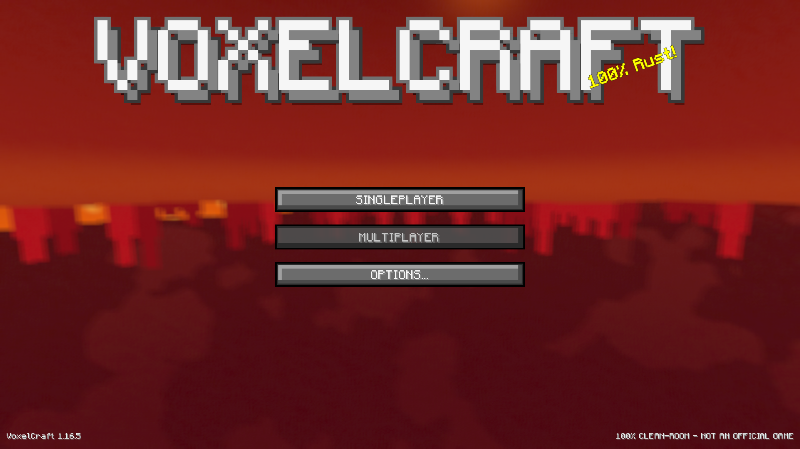
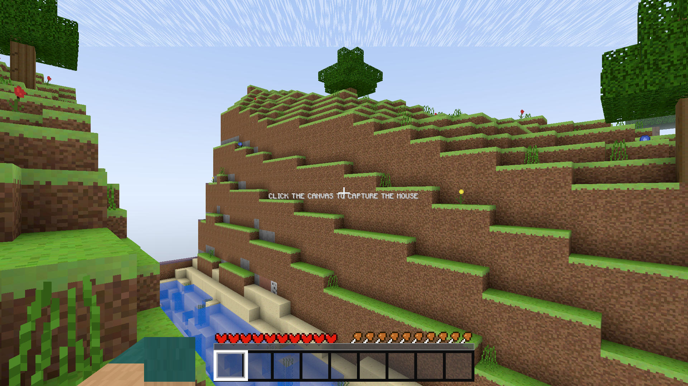
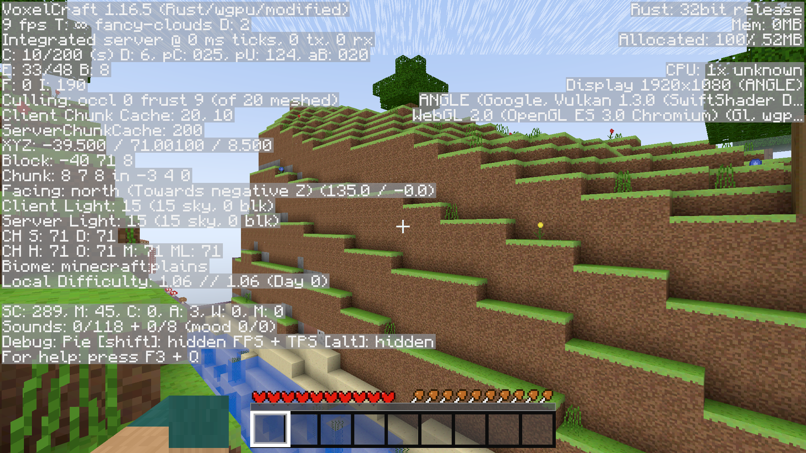
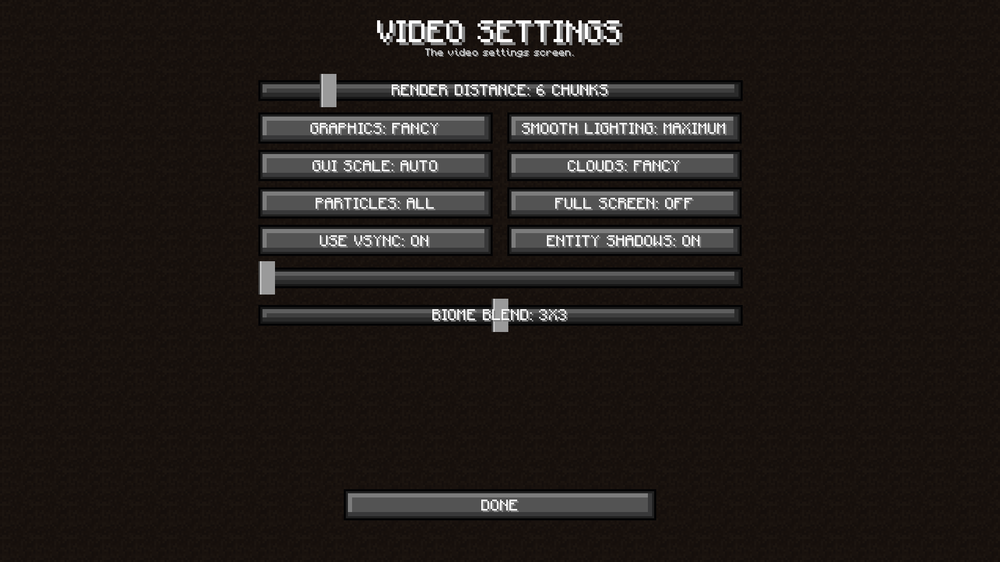
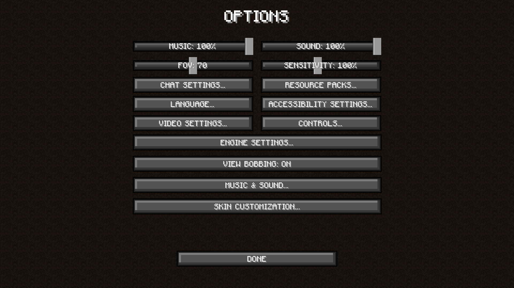
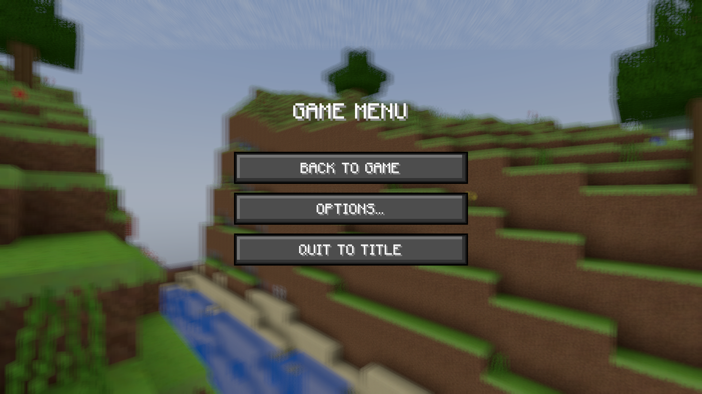

# VoxelCraft

<div align="center">

**A clean-room, Minecraft Java 1.16.5-style voxel engine — written in Rust on `wgpu`.**
One codebase, two targets: **native** (Vulkan / DirectX 12 / Metal) and **browser** (WebGPU with automatic WebGL2 fallback).

[](https://github.com/CodeAbhi826/VoxelCraft-Rust/actions/workflows/ci.yml)
[](https://github.com/CodeAbhi826/VoxelCraft-Rust/actions/workflows/wasm-build.yml)
[](https://github.com/CodeAbhi826/VoxelCraft-Rust/actions/workflows/linux-game.yml)
[](https://github.com/CodeAbhi826/VoxelCraft-Rust/actions/workflows/release.yml)
[](LICENSE)

**818 tests · clippy clean (0 warnings) · WGSL validated · E2E-screenshot verified**

</div>

---

| | | |
|---|---|---|
|  |  |  |
| *Title screen — pre-rendered, panning panorama* | *Survival gameplay — HUD, smooth lighting, biome fog* | *F3 debug overlay — vanilla two-column layout* |
|  |  |  |
| *Video Settings — the vanilla tree + the SHADERS... entry* | *Options — the vanilla settings tree* | *Pause menu over gameplay* |

> All screenshots are captured **live from the browser build** (WebGL2, headless Chromium) — the same bundle this repo ships, driving the same engine as native.

## What this is

VoxelCraft replicates the **gameplay rules, world and boot/menu flow of Minecraft Java Edition 1.16.5** — from published documentation only (minecraft.wiki, live-verified at implementation time, **1,913 `VERIFIED` citations in code**). It is **not** a port, contains **zero Mojang assets** (every texture, sound, glyph and the title panorama is synthesized procedurally at startup), and is a from-scratch Rust/WGSL engine, not a wrapper.

- **533** registered block/item entries (**863** block states), **27 biomes** (overworld families + the five 1.16 Nether biomes + the End), caves, trees, **10 structure families**
- **20 Hz deterministic simulation** with vanilla constants: drag `v1 = (v0 − 0.08) × 0.98`, 7.127 b/s sprint-jump cap, dimension-aware lava spread (Overworld/End 3 blocks/30 ticks, Nether 7 blocks/10 ticks)
- Full **survival loop**: game modes, hunger/exhaustion/saturation model, mobs + combat (attack cooldown, armour, crits, status effects), XP orbs, death & respawn
- Deep systems: **redstone** (repeaters, comparators, pistons, weighted plates), **crafting/furnace/brewing/enchanting** (38 entries), **villager trading** (15 professions, 5 tiers), dungeons & spawners, **weather** state machine, **farming**
- Bosses: **Ender Dragon** (200 HP, crystal healing, 154/200-tick death timeline) and **Wither** (220-tick invulnerable charge, passive regen)
- The complete **vanilla menu flow**: boot intro → panorama title → world select/create (seed, mode, world type incl. Superflat) → loading → gameplay; vanilla-parity Options tree (Video/Music & Sound/Controls/Language/Chat/Accessibility/Skin/Resource Packs)

The engine deliberately tracks the **historical version evolution** (1.0 → 1.16.5, 16 brackets) so each mechanic lands with its era-correct value — see [docs/VERSION-EVOLUTION.md](docs/VERSION-EVOLUTION.md) for the full per-bracket record.

## Quick start

### 1. Browser — zero build

The repo ships the **prebuilt WASM bundle** (auto-rebuilt by CI on every engine change, so `main` is always runnable):

```sh
cd voxelcraft
python3 -m http.server 8080
# open http://localhost:8080/play.html  (Chromium 113+ or any WebGPU browser;
# headless/older browsers fall back to WebGL2 automatically)
```

The same bundle is wired into the tiny Next.js wrapper at the repo root (`src/app/page.tsx` iframes `public/voxelcraft.html`), so `npm run dev` serves the game at `/` as well.

### 2. Linux — one file, zero build

Every push is compiled by [linux-game.yml](.github/workflows/linux-game.yml) into a **single self-contained executable** (the whole engine with the builtin resource pack embedded — no toolchain, no companion files):

```sh
# grab "voxelcraft-*-linux-x64" from the latest run's artifacts (or a Release)
chmod +x voxelcraft-*-linux-x64
./voxelcraft-*-linux-x64          # normal launch
./voxelcraft-*-linux-x64 --debug  # raw diagnostic log (see Troubleshooting)
```

Built on `ubuntu-22.04` (glibc 2.35). Audio is compiled in (ALSA) and degrades to silent if no sound device exists. Full releases (Windows / macOS / arm64 / browser bundle / per-library sources) are on the [Releases](https://github.com/CodeAbhi826/VoxelCraft-Rust/releases) page; `./run-game.sh` launches the newest downloaded single-file build.

### 3. Native build from source

```sh
curl https://sh.rustup.rs -sSf | sh -s -- -y --default-toolchain stable
source "$HOME/.cargo/env"
cd voxelcraft
cargo run --release
```

- Linux audio wants ALSA dev headers (`sudo apt install -y libasound2-dev`); otherwise build with `--no-default-features` for a silent-but-working game
- macOS / Windows work out of the box (CoreAudio / WASAPI)
- wgpu auto-picks the best GPU backend per platform (Vulkan / DX12 / Metal)

### 4. Reusable engine libraries

The engine is split into **14 independent crates** (`vc-nbt`, `vc-blocks`, `vc-world`, `vc-mesh`, `vc-render`, …), each with its own README, examples and test suite — usable as path dependencies in your own projects. Every library also ships as its own source archive on the [Releases](https://github.com/CodeAbhi826/VoxelCraft-Rust/releases) page (deliberately no AIO zip). Full index: **[voxelcraft/LIBRARIES.md](voxelcraft/LIBRARIES.md)**.

## Tech stack

| | |
|---|---|
| Language | Rust 2021 (stable), zero `unsafe` in workspace libraries |
| Graphics | wgpu 22 (native Vulkan/DX12/Metal; web WebGPU→WebGL2 fallback), naga 22 (WGSL validation in tests) |
| Windowing / input | winit 0.29 (+ pointerType-hardened wasm glue) |
| Math / parallelism | glam 0.29, rayon 1.10 (native) |
| WASM | wasm-bindgen 0.2.127 (pinned, CLI-matched), wasm32-unknown-unknown |
| Persistence | vanilla-format Anvil saves (`.mca` + `level.dat`), resource packs & datapacks (folder/zip) |
| CI | 4 workflows: tests (818), wasm bundle auto-rebuild, single-file Linux build, releases |

## Rendering highlights

- **Greedy meshing** with per-vertex ambient occlusion + smooth skylight (BFS flood-fill), merging quads on equal AO/sky corner tuples — an entire flat ocean is one quad
- **GPU compute meshing** — a WGSL greedy mesher, bit-identical to the CPU path, with a 2-strike watchdog that falls back to CPU meshing if the GPU path stalls (the wgpu 22 `create_buffer_init` event-loop lockup class of bugs)
- **Tile-safe atlas sampling** — half-texel UV inset (`[0.5/16, 15/16]`) + analytic gradients: `textureSampleGrad` with the exact atlas-coordinate derivative `dpdx(uv)/32` (uv is face-units, atlas is 32×32 tiles), so bilinear/mipmap/aniso filtering can never bleed neighboring tiles and LOD is exact at every distance
- **Occlusion-flood cache**, frustum culling, one texture atlas = one bind group, copy-on-write chunk edits
- **FSR 1.0** upscaling (EASU/RCAS), MSAA up to 8×, mipmaps/aniso up to 16×, shadow mapping, biome fog, clouds, 8-phase moon & stars
- **Iris integration surface + the Shaders screen** — drop an Iris-format pack (BSL/SEUS-style, third-party) into `shader-packs/`, open Video Settings → SHADERS... to see it scanned, tier-labeled and selectable (the LGPL GLSL→WGSL translator itself is a separate sister project, per the clean-room boundary — the engine ships no built-in shaders). labPBR 1.3 materials (`_n`/`_s` maps, NAPP-style resource packs) are detected, decoded and reported; see `docs/LEGAL-COMPLIANCE.md` for the legal posture
- Flat 14/16 vanilla water surface with scrolling texture (separate blended pipeline, depth-write off)

## Repository layout

```
voxelcraft/                  Cargo workspace — the engine + the game
  crates/                    14 vc-* libraries + the voxelcraft app (see LIBRARIES.md)
  builtin-pack/              1.16.5-format resource pack (blockstates/models/PNGs)
  builtin-packs/             programmer-art pack (pre-1.14-style clean-room look-alikes)
  shader-packs/              user-dropped Iris-format shader packs (never shipped by us)
  wasm-out/                  prebuilt wasm-bindgen output
  play.html                  standalone browser loader
  BUILD.md                   full build instructions (native + wasm + all-arch)
docs/                        WORKLOG.md (session log), VERSION-EVOLUTION.md,
                             CHECKLIST-VERIFIED-AUDIT.md, PARITY-BACKLOG.md,
                             research records, screenshots/
public/                      the wasm bundle, wired into the Next.js preview wrapper
src/app/page.tsx             Next.js wrapper that serves the game at /
run-game.sh                  launches the newest CI single-file Linux build
```

The Next.js app at the root is only a thin preview wrapper — the game itself is entirely in `voxelcraft/`.

## Controls

| Key | Action |
|---|---|
| WASD | Move |
| Mouse | Look around (cursor is locked) |
| Space | Jump / swim up / fly up |
| **Double Space** | Toggle flying (**Creative only**) |
| Shift | Fly down / sneak in water |
| Ctrl | Sprint (FOV widens) |
| Left click (hold) | Break blocks |
| Right click (hold) | Place blocks |
| Middle click | Pick block into hotbar |
| 1–9 / wheel | Select hotbar slot |
| E | Inventory |
| F3 | Debug overlay (vanilla two-column layout; hold F3 for +Q/+1/+H combos) |
| H | Help screen |
| `[` `]` | Render distance – / + |
| `-` `=` | Volume – / + |
| V | Toggle V-Sync |
| Esc | Pause / release mouse |

## Troubleshooting

- **Browser**: needs WebGPU (Chromium 113+) or WebGL2 — the engine auto-falls back and both paths are E2E-verified. Append `?debug` to the page URL to mirror the boot log into the JS console.
- **Linux mouse/pointer**: look-around uses a three-rung capture ladder `Locked → Confined → delta-look`, auto-negotiated at every capture and logged via the `pointer:` line (`--debug`). If your compositor grants no lock, delta-look keeps the game playable with a visible cursor. Details: [voxelcraft/BUILD.md](voxelcraft/BUILD.md).
- **No sound on Linux**: install ALSA headers and rebuild, or run the no-audio build (`--no-default-features`).
- **GPU chunk meshing stalls**: the 2-strike watchdog automatically switches to CPU meshing and logs it — file the `--debug` log.

## Rebuilding the browser bundle

```sh
cd voxelcraft
rustup target add wasm32-unknown-unknown
cargo build --release --target wasm32-unknown-unknown --lib
wasm-bindgen --version 0.2.127 --target web \
  --out-dir ./wasm-out target/wasm32-unknown-unknown/release/voxelcraft.wasm
python3 patch-wasm-glue.py wasm-out/voxelcraft.js
# then copy the locked pair (js + wasm together, never one without the other)
cp wasm-out/voxelcraft.js wasm-out/voxelcraft_bg.wasm ../public/
```

CI does exactly this on every engine change and commits the bundle back to `public/`, so `main` always runs without a local toolchain. Details: [voxelcraft/BUILD.md](voxelcraft/BUILD.md).

## Verification

- **818/818 tests green** (`cargo test --release --no-default-features --workspace`, plus the `bench-bin`-featured CI gate at 80/80) — including WGSL parse+validation of every shader via naga, drift-guard tests for every historical bug fix (texture-seam quartet, flat water, FSR identity-at-1×, …), and per-subsystem constant checks against the wiki values
- **clippy: 0 warnings** across the workspace, all targets
- **CI on every push**: native tests, wasm32 compile-check, headless benchmark, single-file Linux build, wasm bundle rebuild
- **E2E screenshot verification** of the live bundle: boot → title → world create → gameplay → F3/inventory/pause (the screenshots above are those captures)
- The subsystem-level verified status (done / partial / deferred-and-why) lives in [docs/CHECKLIST-VERIFIED-AUDIT.md](docs/CHECKLIST-VERIFIED-AUDIT.md) — maintained against the live wiki and the code, not against marketing

## Legal

> **NOT AN OFFICIAL MINECRAFT PRODUCT. NOT APPROVED BY OR ASSOCIATED WITH MOJANG OR MICROSOFT.**
> (Wording follows the disclaimer Mojang's own *Usage Guidelines for Fans and Creators* asks fan projects to carry.)

- **Trademark**: "Minecraft" is a trademark of Mojang Synergies AB. This project is an independent engine, not affiliated with, endorsed by or connected to Mojang or Microsoft. It brands itself "VoxelCraft" everywhere user-facing.
- **Clean-room assets**: every texture, sound, UI glyph, logo and the title panorama is **procedurally synthesized in code** (`v113_art.rs` … `v116b_art.rs`, 19 modules). No Mojang asset file was ever copied, sampled or distributed — the repo contains **zero binary asset files from Mojang**.
- **Mechanics, not code**: game rules, formulas, timings and recipe/loot schemas are facts replicated from published documentation, never from decompiled code. The `minecraft:` namespaced ids inside save/pack code are format interop (the same convention every third-party world editor uses), never in-game branding.
- **Font**: the bundled Monocraft font (`voxelcraft/crates/vc-render/assets/Monocraft.ttf`) is © 2022 Idrees Hassan ([IdreesInc/Monocraft](https://github.com/IdreesInc/Monocraft)), used under the **SIL Open Font License 1.1** — see [`OFL-Monocraft.txt`](voxelcraft/crates/vc-render/assets/OFL-Monocraft.txt).

## License

Licensed under the **Apache License 2.0** — see [`LICENSE`](LICENSE). In short: use, copy, modify and distribute (including commercially), retaining the license notice and stating significant changes. Game *mechanics and data* (formulas, timings, recipe/loot schemas, registry names) are not copyrightable and are replicated from published documentation; all *assets* are independently authored and contain no Mojang material. The Monocraft font keeps its own OFL 1.1 license.

## Documentation index

| Document | Contents |
|---|---|
| [voxelcraft/BUILD.md](voxelcraft/BUILD.md) | Full build instructions — native, wasm, all-arch, troubleshooting |
| [voxelcraft/LIBRARIES.md](voxelcraft/LIBRARIES.md) | The 14 engine libraries + per-library usage |
| [docs/WORKLOG.md](docs/WORKLOG.md) | The complete session-by-session development log |
| [docs/VERSION-EVOLUTION.md](docs/VERSION-EVOLUTION.md) | The 16-bracket 1.0 → 1.16.5 implementation record |
| [docs/CHECKLIST-VERIFIED-AUDIT.md](docs/CHECKLIST-VERIFIED-AUDIT.md) | Per-subsystem verified status (done/partial/deferred) |
| [docs/PARITY-BACKLOG.md](docs/PARITY-BACKLOG.md) | Known parity gaps and the deferred list |
| [docs/research/](docs/research/) | Per-round wiki research records |
